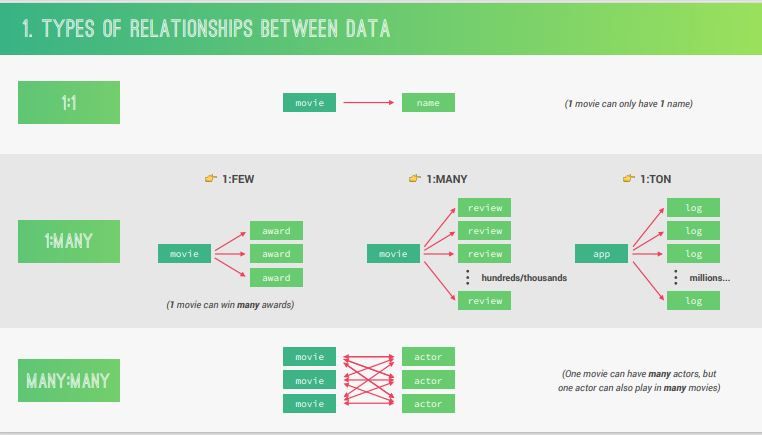
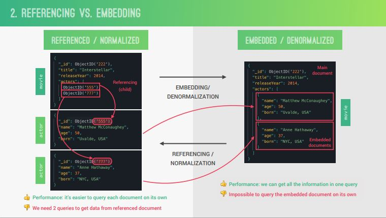
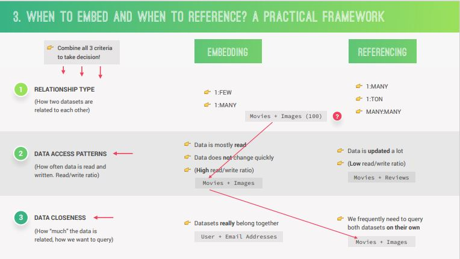
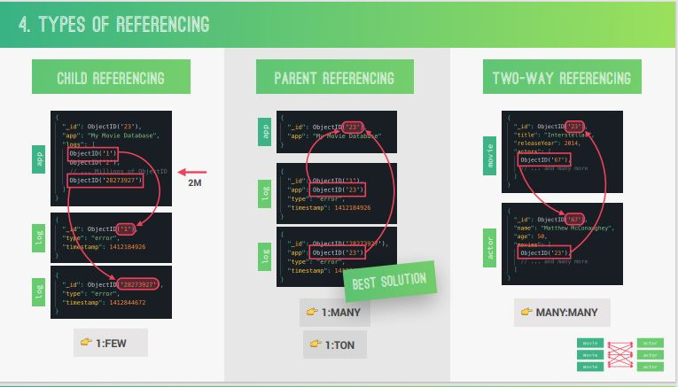
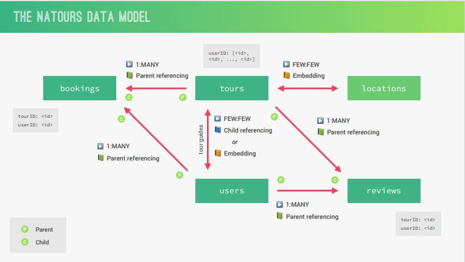

# `MODELLING DATA AND ADVANCED MONGOOSE`

Knowing how to work with data is one of the most important and valuable skills tha we can have as a backend developer. That's why in this section we're gonna dive really deep into data modeling concepts and techniques. By the end of this section our API will be fully functioning with all routes and all resources, a complete authentication and authorization, and also all established relationships between all the data sets.

---

## `Table_Of_Contents

1. [MongoDB_Data_Modeling](#mongodb_data_modeling)
2. [Designing_Our_Data_Model](#designing_our_data_model)
3. [Modelling_Locations__Geospatial_Data](#modelling_locations__geospatial_data)
4. [Modelling_Tour_Guide__Embedding](#modelling_tour_guide__embedding)
5. [Modelling_Tour_Guides__Child_Referencing](#modelling_tour_guides__child_referencing)
6. [Populating_Tour_Guides](#populating_tour_guides)
7. [Modelling_Reviews__Parent_Referencing](#modelling_reviews__parent_referencing)
8. [Creating_and_Getting_Reviews](#creating_and_getting_reviews)
9. [Populating_Reviews](#populating_reviews)
10. [Virtual_Populate__Tour_and_Reviews](#virtual_populate__tour_and_reviews)
11. [Implementing_Simple_Nested_Routes](#implementing_simple_nested_routes)
12. [Nested_Routes_with_Express](#nested_routes_with_express)
13. [Adding_A_Nested_GET_Endpoint](#adding_a_nested_get_endpoint)
14. [Building_Handler_Factory_Functions__Delete](#building_handler_factory_functions__delete)
15. [Factory_Functions__Update_and_Create](#factory_functions__update_and_create)
16. [Factory_Functions__Reading](#factory_functions__reading)
17. [Adding_A_Me_Endpoint](#adding_a_me_endpoint)
18. [Adding_Missing_Authentication_and_Authorization](#adding_missing_authentication_and_authorization)
19. [Importing_Review_and_User_Data](#importing_review_and_user_data)
20. [Improving_Read_Performance_with_Indexes](#improving_read_performance_with_indexes)
21. [Calculating_Average_Rating_on_Tours-PART_1](#calculating_average_rating_on_tours-part_1)
22. [Calculating_Average_Rating_on_Tours-PART_2](#calculating_average_rating_on_tours-part_2)
23. [Preventing_Duplicate_Reviews](#preventing_duplicate_reviews)
24. [Geospatial_Queries__Finding_Tours_Within_Radius](#geospatial_queries__finding_tours_within_radius)
25. [Geospatial_Aggregation__Calculating_Distances](#geospatial_aggregation__calculating_distances)
26. [Creating_API_Documentation_Using_POSTMAN](#creating_api_documentation_using_postman)

---

## `MongoDB_Data_Modeling`

***For this lecture must read pdf file as well.***  
One of the most important steps in building intensive apps is to actually model all this data in MongoDB. And so that's what we're gonna talk about in this lecture. So, it's really crucial that we follow it through even at first its a lot to take in.

### `What is Data Modeling?`

**Data modeling is the process of taking unstructured data generated by a real world scenario, and then structured it into a logical data model in a database.**  And we do that according to a set of criteria which we're gonna learn about in this lecture. For example let's say that we want to design an online shop data model. There will be initially a ton of unstructured data that we know we need, stuff like products, categories, customer's orders, shopping carts, suppliers..., Our goal with data modeling is to then structuring this data into a logical way, reflecting the real-world relationships that exists between some of these data sets. `SEE PDF FILE`  

Data modeling is the most demanding part of building an entire application. Because it really is not always straight forward. So there is not just one unique correct way of structuring the data.  

#### `We're gonna go through four steps`

1. In first step we **learn about how to identify different types of relationships between data.**
2. Then we're gonna **understand the difference referencing or normalization and embedding or denormalization.**
3. In the next and most important step; will show my(jonas) **framework for deciding whether we should embed documents or reference to other documents based on a couple of difference factors.**
4. Also we've to quickly talk about **different types of referencing**, because that's important if that is the type of design that we choose for our data.

**`Now deep dive into each steps`**

##### `Different types of Relationships that can exist between different data`

There are three big types of relationships. **One to One(1:1)**, **One to Many(1:many)**, And M**any to Many(many:many)**.  

We'll gonna use a movie application as an example here.  

1. **1:1 Relationships:** One filed can only have one value. one movie only ever have one name.

2. **1:many Relationships:** This is the most important relationships, and they are so important that in mongodb we actually distinguish between three types of one to many relationships. one to few, one to many, one to a ton/a-million.  
    **Example of one to few** is that one movie can win many awards, but just a few.  
    **Example of one to many** is that one movie can have thousands of reviews.

    ***In general one to many relationships means that one document can relate to many other documents.***

3. **many:many Relationship:** one movie can have many actors, and at the same time one actor can play in many movies. so here a **relationship goes in both directions while other two goes in only one direction.** For example one movie can have many reviews, but one specific review is only for one movie.



---

##### Referencing VS Embedding Two Datasets

**Each time we've two related datasets we can either represent that related data in a reference or normalized form or in an embedded or denormalized form.**  

In a **Reference Form** we keep two related datasets and all the documents separated. All the data is nicely separated, which is exactly what normalized means. we would have one movie document and one actor document for each actor.  
Now how do we then make a connection between movie and the actors so that later in our app we can show which actors played in a particular movie. Because a movie has no way of knowing about the actors.  
Well that's where the IDs come in. So, we use the actor IDs in order to create references on the movie document. Effectively connecting movies with actors.

`SEE PDF FILE`



In the movie document we've and array where we stored ids of all the actors, so when we request data about a certain movie we can easily identify its actors. This type of referencing is called **`child referencing`**, because its the parent, in this case the move, who referencing its children, in this case the actors.
So we're really creating some sort of hierarchy here.  
*Now there is also parent referencing, we talked bout bit later.*

**And by the way in relational database. All data is always represented in normalized form. But in NoSQL database like mongoDB, we can denormalize data into a denormalized form simply by embedding the related documents right into the main document.** So, now we've all the relevant data about actors right inside the one main movie document without the need for separate documents, collections, and IDs. So, if we choose to denormalize or to embed our data we will have one main document containing all the main data as well as the related data. And the result of this is that our application will need to fewer queries to the database, because we can get all the data about movies and actors all at the same time, which will increase our performance. Now the downside here is of course that we can't really query the embedded data on its own. And so if that's a requirement for the application we would have to choose a normalize design. Since we're talking about pros and cons of the denormalized form, lets do the same about the normalized design.  

Basically normalize form is kind of the opposite of embedded, there is an improvement in performance when we often need to query the related data on its own, because we then can just query the data that we need and not always movies and actors together. But on the other hand when we need to actually query movies and actors together we then are gonna many queries to the database.

**How do we actually decide if we should normalize or denormalize the data?**  
When we've two related datasets; we have to decide if we're gonna embed the datasets or if we're gonna keep them separated and reference them from one datasets to the other. We use three criteria to take that decision.  

1. First we look at the **type of relationships** that exist between datasets.
2. We try to determine the **data access pattern** of the dataset that we want to either embed or reference. And this just means to analyze how often data is read and written in that dataset.
3. **Data Closeness:** Data closeness is term that I(Jonas) actually just made up, but what it means is how much the data is really related, and how we want to query the data from the database.  
Now to take the decision; we need to combine all of these three criteria.  



Now let's say that we have chosen to normalize/reference our datasets. Then after that we still have to choose between three different types of referencing, `Child Referencing`, `Parent Referencing`, and `Two-Way Referencing`.

1. **Child referencing:** **In child referencing we basically keep references to the related child documents in a parent document.** And they are usually stored in an array. Each document(child) has an id and all the id will store in parent document. The problem is that, this array of ids can become very large if there are lots of children. And this is an anti-pattern in mongodb, something the we should avoid at all costs. Also child referencing makes it so that parents and children are very tightly coupled.

2. **Parent referencing:** In parent referencing, **each child document keep a reference to the parent element**. The child always knows it's parent, so in this case the parent actually knows nothing about the children.  

    **The conclusion is that in general child referencing is best used for one to a few relationships. On the other hand parent referencing is best used for one to many and one to a ton relationships.** Always keep in mind that one of the most important principle of data modeling is that array should never be grow indefinitely, In order to never break that 16MB limit. (one document must has < 16MB size)

3. **Two way referencing:** **We usually use this two way referencing to design many to many relationships.** And it works like this, In each movie we will keep references to all the actors that play in that movie. And at the same time in each actor we also keep references to all the movies that the actor played in. Movies and actors are connected to both directions.



***In general always favor embedding, unless there is good reason nto to embed.***

---

## `Designing_Our_Data_Model`

Let's now use that theory in order to actually design the data model of our Natours app. And this the most difficult part of building an app.

Let's start with all the datasets that we actually need in our application, `Tours`, `Users`, these two we already have. Tours and users are two completely separate(normalized) datasets. Next up, we're also gonna have `Reviews`, and we'll also have `Locations`. Because most tours actually have a number of different locations. And finally we also gonna have `Bookings`.  
We've all these datasets. Now let's actually model the relationships that exist between them.

`Users` | `Tours` | `Reviews` | `Locations` | `Bookings`

### `Relationship between Users and Reviews`

This relationship is clearly a one-to-many relationship, because one user can write multiple reviews, but one review can only belong to one user. And the parent in this relationship is clearly the users. Anyway, we choose to model this relationship using parent referencing, and that's because a user can write a lot of reviews and also because we might actually need to query only for the reviews on their own. It's parent referencing, basically the review keeping a reference of the user, so keeping an ID.

### `Relationship between Tours and Reviews`

Again it's one to many relationship. where one tour can have multiple reviews but one review can only be about one tour. We model it exact same way as users-review relation. So, again parent referencing, and in the end the reviews end up with a tour id and user id. Then once we query a review we always know exactly tour, and user of belongs to this review.

### `Relationship between Tours and Location`

Each tour is gonna have a couple of locations,  and each of location can also be part of another tours. So here few-to-few (many-to-many) relationship. This could be a good example of two-way referencing. so basically normalizing the locations into its own dataset. Here but instead we're gonna denormalize the locations, so to embed them into the tours. **That's for few reasons:**

1. Because there only so few locations.
2. Also we will not gonna access the locations on their own.
3. Also these locations are intrinsically related to the tours because really without locations there couldn't be any tours. So we embed locations to tours.

### `Relationship between Tours and Users`

This relationship is again a few-to-few relationship, because one tour can have only a few users(so a few tour-guides), but at a same time, each tour guide can also be guiding a few tours. Modeling this relationship we could do it in two ways, by referencing or embedding.

### `Bookings`

Basically a new booking will be created each time that a user purchases a tour. So, this is still kind of a relationship, between users and tours. because it's a user who is gonna buy a tour. But we also want to store some data about the relationship itself, so in this case about the purchase itself in our database, for example the price or the date when the purchase happened or something like that. So in case like this it's a good idea to create an extra dataset, which is in this case bookings.  
And so, of course there will be a relationship between tours and bookings and also users and bookings. Because the booking connects tours with users but kind of with an intermediate step. So, one tour can have many bookings, but one booking can only belong to one tour, and the same thing with the users. so one user can book many tours, and but one booking can only belong to one of the users. So of course we've a one-to-many relationship in both cases, and also in both cases we're gonna use parent referencing. so that means that on each booking we're gonna keep an id of both the tour that was purchased and also of the user who actually purchased the tour.



---

## `Modelling_Locations__Geospatial_Data`

Now we're finally gonna start implementing our data model, and starting with the locations. So in this lecture we're gonna learn all bout geospatial data in MongoDB.  
Remember from the previous lecture that our location data will actually be embedded into the tours. And so therefor we're basically gonna declare everything that is related to locations in our tour model. so let's open tourModel file.

So we'll have startLocation and then also, locations in general. Now mongodb supports geospatial data out of the box. **And geospatial data is basically data that describes places on earth using longitude and latitude coordinates.** So we can describes simple points, or we can also describe more complex geometries, like lines or even polygons, or even multi-polygons.  
Lets implement this geospatial data. And mongodb uses a special data format called `GeoJSON`, in order to specify geospatial data.  

**Now how does this actually work?**  

```js
startLocation: {

} 
```

This object we specified here is actually, this time not for the schema types options as we have it before. up there like:⤵

```js
secretTour: {
  type: Boolean,
  default: false
}  
```

But now the object is actually really an embedded object. And so inside this object, we can specify a couple of properties. And in order for this object to be recognized as geospatial JSON, we need the **type** and the **coordinates properties**, So, we need type and we need coordinates and now each of these fields(type and coordinates) then gonna get it's own schema type options. so basically here it's a bit nested, we are one level deeper.  

So we've type schema type options and then we also need schema type options for coordinates.  
**For type the type will be string**, and default will be 'Point', we could also specify polygons or lines.. as a default. But this is a standard to put 'Point' as a default. And we also specify the only possible options by defining the enum(enumeration) property. In this case we only want a point.  

**We need to define type for coordinates too, an array of coordinates. coordinates: [Number],** it means that we expects an array of numbers. **And this array as the name says is the coordinates of the point with the longitude first and second the latitude, this's a bit counterintuitive**(متضاد) because usually it works the other way around, that's how it works in GeoJSON. if we see GoogleMaps, there will be the fist latitude and then the longitude.

```js
startLocation: {
  // GeoJSON
  type: {
    type: String,
    default: 'Point',
    enum: ['Point']
  },
  coordinates: [Number],
},
```

Remember the `latitude` is basically the horizontal position measured in degrees starting from the equator, so equator it's zero degrees and in the north pole it's 90 degrees. And longitude is just the same thing but vertically.

We also want to specify a property for the address as a string and also a description for this start location again as a string.  

In order to specify geospatial data with mongodb we basically need to create a new object such as we did here, And that object then needs to have at least two field names coordinates as array of numbers and then the type which should be type of string, may be points, lines, or any other geometries, and we can add some more fields, such as we did here,  

```js
startLocation: {
  // GeoJSON
  type: {
    type: String,
    default: 'Point',
    enum: ['Point']
  },
  coordinates: [Number],
  address: String,
  description: String
},
```

Remember in last lecture we said, we're gonna embed all the locations into the tour documents, but right now this startLocation here is not really a document itself. It's really just an object describing a certain point on the earth. But in order to really create new documents and then embed them into another document we actually need to create an array, So it's actually very similar to what we already have here, but it needs to be an array. so that's what we're gonna do with our locations. so,  

```js
location: [
  {
    type: {
      type: String,
      default: 'Point',
      enum: ['Point']
    },
    coordinates: [Number],
    address: String,
    description: String,
    day: Number, // this day will basically be the day of the tour in which people will go to this location.
  }
]
```

Now if we wanted to make it simpler, we could delete the startLocation all together, and then simple define the first location as the startLocation and set it to day number zero. But it's nice to also have the startLocation as a separate field. So this is how we create an embedded documents.  
***Remember we always need to use array. so by specifying an array of object, this will then create brand new documents, inside of parent document, which is in this case the tour.***  
In order to create some locations we're actually going to import all our original data, so instead of creating new tours, we'll delete the ones we have. and then import complete data. in dev-data folder, remember before we imported tours-simple.json file, but we also have tours file and this then actually has locations and the startLocation. In each locations we see each location has it's own id, so these are really are documents, not just simple objects. So lets go to our import-dev-data.js and replace in fs.readFileSync(`${__dirname}/tours.json`, 'utf8'); and them first delete existing tours using --delete and import using --import

```js
$ node ./dev-data/data/import-dev-data.js --delete  
node ./dev-data/data/import-dev-data.js --import
```

---

## `Modelling_Tour_Guide__Embedding`

Remember in lecture about data model we said that we could either embed or reference the tour guide data, so in this lecture I'm gonna show how we could implement embedding tour guide documents into a tour document.  
So, in this lecture we're going to embed user documents into tour document and then in the next lecture, I'll show how we can actually reference users instead of embedding.  
So, The idea here is that when creating a new tour document the user will simply add an array of user ids, and we will then get the corresponding user documents based on these ids and add them to our tour documents, in other words, we embed them into our tour. Lets' do that in tourModel.js

```js
// In Tour Schema
guides: Array
```

**How this would word when creating a new tours?**  
When creating a new tour we add a guides property and the value would ba an array of ids as we defined here. like "guides":["438jk1jlk, "kj1dk1jk3"], like this. And once we then save this tour, we'll then behind the scenes, retrieve the two user documents corresponding to these two ids. So lets implement that. The best place of the best place implement that is a pre-saved middleware. So that will then happen automatically each time that a new tour is saved. in tourModel file.

we get this.guides as an input, and remember this is gonna be an array of all the user ids. so we'll loop through them using .map method and then in each iteration get the user document for the current id and store them insides of guides.  
Here we need User, so import that, and we will find using this id from User. And actually we need to await this promise here and make the map function as an async function.

```js
tourSchema.pre('save', function (next) {
  const guides = this.guides.map(async (id) => await User.findById(id));

  next();
});
```

BUT now we actually get a problem, because the map method will assign the result of each iteration to the new element to the guides array. Now we have an async function, as we know that returns a promise,  and right now this guides array is basically an array of full of promises. So lets call this guidesPromise. And so we now actually need to run all of these promises at the same time. So here all we need to is to await Promise.all(guidesPromises). and we directly assign the result ot this Promise.all to this.guides, basically override that simple arrays of ids with an array of user documents.

```js
// In Tour Model
tourSchema.pre('save', async function (next) {
  const guidesPromises = this.guides.map(async (id) => await User.findById(id));
  this.guides = await Promise.all(guidesPromises);

  next();
});
```

That's it.  
Now we get the guides as a complete documents, not just ids, that we specify in the body.  
This is how we could implement embedding for this tour guides.  

**Now this simple code that we implemented here, of course only works for creating new documents, not for updating them.**  Now we would go ahead and implement this same logic also for updates. However, we're not gonna do that, because from the lecture where we modeled our data, there are actually some drawbacks  embedding this data in this case. For example imagine that a tour guide updates his email address, or they change their role from guide to lead guide. Each time one of these changes would happen then we would have to check if a tour has that user as a guide, and if so, then update the tour as well. And so thats really a lot of work, so we're not gonna go in that direction.  
In this particular case we use referencing instead of embedding.

```js
// In tour schema - A field
guides: Array, 

// In Tour Model - Middleware function
tourSchema.pre('save', async function (next) {
  const guidesPromises = this.guides.map(async (id) => await User.findById(id));
  this.guides = await Promise.all(guidesPromises);

  next();
});
```

---

## `Modelling_Tour_Guides__Child_Referencing`

So we embedded users into tours in last lecture, and also talked about the drawbacks of that approach in our specific situation. So in this video let's actually connect tours and users not by embedding but instead by a reference.

**This time in this video the idea is that tours and users will always remain completely separate entities in our database.**  
So all we save on a certain tour document is the ids of the users that are the tour guides for that specific tour. Then when we query the tour we want to automatically get access to the tour guides, without them being actually saved on the tour document itself. And that exactly is referencing.  

**How we implement referencing in mongoose?**  
Here in TourSchema, in the guides will now want to specify an array just like we did before, but this time with the locations. these means this guides will be some sub-documents.

```js
// Tour Schema
guides: [
  {types: mongoose.Schema.ObjectId}
]
```

Here the type will be new one, and that's `mongoose.Schema.objectId`. It means is that we expect type of each of the elements in the guides array to be a MongodB Id. And all of these(types: mongoose.Schema.ObjectId)should be inside of an object, just like any other schema type definition. And here we also need to specify the reference, this is where the magic happens behind the scenes. Here now we say that the reference should be User. so this is how we establish references between different data sets in Mongoose. And for this we do not even need to have the user to be imported into this document. We actually required before in previous lec, but we don't even need it.  

```js
// guides: Array,
guides: [
  {
    type: mongoose.Schema.ObjectId,
    ref: 'User'
  }
]
```

Let's no go ahead and create a new tour. To test just like before we pass a guides with array of ids, but this time we actually specified that an object Id is exactly what we expect. And behind the scenes, it's also referenced to the user. When we create this tour it will actually only contains ids that we specified in guides in body, not the corresponding users.  
This is how we pass in body as a new user.  

```json

{
    "name": "Test Tour One!",
        "duration": 1,
    "maxGroupSize": 1,
    "difficulty": "difficult",
    "price": 200,
    "summary": "last tour",
    "imageCover": "tour-3-cover.jpg",
    "ratingsAverage": 4.9,
    "guides":["6544bad7e0268d39645e1a07", "6546016675e85446a85dcfed"]
}
```

As we expected we have only ids in the response. So for now only we have references inside of mongoose. As we talked in parent referencing the parent will store the ids of each child.  
In the next video we'll then take care of actually displaying the user data in the output using a process called populating.

---

## `Populating_Tour_Guides`

Let's now use a process called populate in order to actually get access to the referenced tour guides whenever we query for a certain tour. In the last lecture we created a reference to the user in the guides field in our tourModel. Now we're gonna use populate in order to basically replace the fields that we referenced with the actual data, and the result of that will look as if the data has always been embedded. In fact as we know it is in a completely different collection.

**Now the populate process always happens in a query.** So let's now go to our tourController and then right to the function where we get a single tour, in getTour.

so in findById query we need to add populate the query just like this.

```js
const tour = await Tour.findById(req.params.id).populate('guides');
```

**In populate will pass the name of the field**, which we actually want to populate, in this case that's guides. So, we want to populate, basically to fill up the field called guides in our model. And again this guides field only contains the references, **And with populate we're then gonna fill it up with the actual data, only in the query not in actual database.**  

This is what we to do, now take a look. Now if we getTour with that id, where we put "guides":["", ""], then we see the tour with all the user's data that are corresponding to that ids. And if we now take a look at get all tours, here we have only the values that are actually in the database, only ids in guides field, also in compass. In getAllTours only showing ids because we didn't implement the populate till now.

Let me just show you a small trick that we can do with the populate function. Which is to actually also just select the certain fields, for example we're not interested in this __v property, and also not in passwordChangedAt property.

So, in populate, we can actually specify that, instead of just passing a string of field name, we can create an object of options. the path, which is name of field, is guides, and then we use select property and the value should be the name of  properties that we want to deselect with minus sign.  

```js
cont tour= await Tour.findById(req.params.id).populate({
  path: 'guides',
  select: '-__v -passwordChangedAt'
})
```

So, this populate function is an absolutely fundamental tool for working with data in Mongoose, and especially of course when there are relationships between data. We should always know exactly how and when to use it in our own applications.  

Now one thing that should keep in mind, is that behind the scenes, using populate will still create a new query, and so this might affect our performance. In kind of small application, this small hit on performance is not a big deal at all. but in huge app with tons of populates that might indeed have some kind of effects. Really it makes sense, because how else would mongoose be able to get data about tours and users at a same time. It need to create a new query basically in order to be able to create this connection.

```js
exports.getTour = catchAsync(async (req, res, next) => {
  const tour = await Tour.findById(req.params.id).populate({
    path: 'guides',
    select: '-__v -passwordChangedAt',
});
...
...
...
});
```

In getAllTours we've not implemented yet, one solutions may be copy the code from here and past it in getAllTour handler as well, but not a good practice. So instead of this we use a query middleware.  
So let's quickly go ahead and move to our tourModel and add a middleware there.

tourSchema.pre(), then we in pre we will pass a regular expression for everything that start with find.  
We do this in query middleware, because this is a middleware that is going to run each time these is a query.  
Remember in query middleware this always points to the current query. And so now basically all of the queries will then automatically populate the guides field with the referenced user.  

```js
tourSchema.pre(/^find/, function (next) {
  this.populate({
    path: 'guides',
    select: '-__v -passwordChangedAt',
  });
  next();
});

```

*Now you have extremely powerful tool.*  

`QUICK RECAP`  
This is a two step process, First we create a reference to another model like we did in tourModel, by adding guides field and specify the type and ref property. Then in the second step we populate that field, that we specify in populate method.

---

## `Modelling_Reviews__Parent_Referencing`

In this lecture, let's continue to translate the data model that we established right at the beginning into some actual code. And in this time we're gonna implement the reviews model.  
So the first step is to create a new file in models folder call it reviewModel.js

**Small challenge** to create a review model, with fields: `review` / `rating` / `createdAt`(current timestamp) / `reference to tour that this review belongs to` / `reference to the user who wrote this review`, so basically two parent references here.

A review need to belongs to any tours, and also need an author, so basically we're implementing parent referencing  here in this case, because both the tour and the user are in a sense the of this data set, and we decided this way because we don't want a huge array in a parent element. In many situations, when we do not really know, how much our array will grow, then it's just best to opt for a parent referencing. Now go ahead an implement that.

```js
tour: {
  type: mongoose.Schema.ObjectId,
  ref: 'Tour',
  required: [true, 'Review must belong to a tour'],
},
```

By doing this, each review document now knows exactly what tour it belongs to, while the tour of course doesn't know initially what reviews and how many reviews there are, This is a problem we'll solve a bit later.

Next up we also should know who wrote this review.

```js
user: {
  type: mongoose.Schema.ObjectId,
  ref: 'User',
  required: [true, 'Review must belong to a user'],
},
```

Just to finish lets actually add these options to the Schema where we make it so that virtual properties also show up in json and object outputs.

```js
{
  toJSON: { virtuals: true },
  toObject: { virtuals: true },
}
```

All this⤴ does is to really make sure that when we have a virtual property, basically a field that is not stored in the database, but calculated using some other values. We want this to also show up whenever there is an output.

```js
const mongoose = require('mongoose');

const reviewSchema = new mongoose.Schema(
  {
    review: {
      type: String,
      required: [true, 'Review can not be empty!'],
    },
    rating: {
      type: Number,
      min: 1,
      max: 5,
    },
    createdAt: {
      type: Date,
      default: Date.now,
    },
    tour: {
      type: mongoose.Schema.ObjectId,
      ref: 'Tour',
      required: [true, 'Review must belong to a tour'],
    },
    user: {
      type: mongoose.Schema.ObjectId,
      ref: 'User',
      required: [true, 'Review must belong to a user'],
    },
  },
  {
    toJSON: { virtuals: true },
    toObject: { virtuals: true },
  }
);
const Review = mongoose.mode('Review', reviewSchema);

module.exports = Review;
```

---

## `Creating_and_Getting_Reviews`

In this lecture we're gonna continue implementing the review's resource, and this time by implementing an endpoint for getting all reviews and also for creating new reviews. At this point, we're basically just reviewing stuff that we already learned before in previous sections.  
So As a `challenge` you've to implement both these endpoints, so one endpoint for getting all review, and  one for creating new review. Create a controller file and in their create the controller functions, and also create the routes in a new review routes file, and also create some new reviews and also retrieve them from the database using get all reviews.

```js
app.use('/api/v1/reviews', reviewRouter);
```

This router here⤴ in this case reviewRouter is basically a middleware that we mount upon this path '/api/v1/reviews', so whenever there is a request with a url that start like this('/api/v1/reviews'), then this middleware function here will basically be called. so in there just  slash route / will will be api/v1/reviews

---

## `Populating_Reviews`

Lets now populate the reviews with both the User and the Tour data. So, just like we did on tour, let's now make is so that both the tour and the user will automatically populated each time there is a query for a review.  
When we want to populate two fields, we need to actually call populate twice. so once for each of the fields.

In reviewModel lets implement our pre find middleware.  
**In .pre middleware we as usual we pass in a function and in that function the this always points to the current query.** So we want to populate on the current query, so this.populate(), We will now actually specify the options object because we only wan to select a couple of fields, not the entire tour, and entire user.

```js
path: 'tour', 
```

Here tour⤴ means, actually we specified exact same name 'tour' fields in Schema, is then going to be one that's populated based on Tour model, because we specified 'Tour' in ref property in tour filed. So in Tour collection then mongoose going to look for documents with the id that we specified.

```js
select: 'name', 
// we only wants the name of the tour.
```

And if we want to populate multiple fields, we need to do is to call populate again.
lets' test it.

```js

reviewSchema.pre(/^find/, function(next) {
  this.populate({
    path: 'tour',
    select: 'name'
  }).populate({
    path: 'user',
    select: 'name photo'
  });

  next();
});

```

---

## `Virtual_Populate__Tour_and_Reviews`

`Pretty advanced mongoose feature called 'Virtual Populate'`  

At this point we've populate the Reviews with the Tour and the User data. So right now if we query for reviews we get access to that information. However that still leaves one problem unsolved. So,  

**How are we going to access reviews on the tours?** basically the other way around. Because we have both tour and user's id on the Reviews, but we don't have access to the Reviews themselves from the Users and Tours because there is nothing stored in User/Tour model about Reviews.
**So let's say that we queried for a specific tour, then how will we get access to all reviews for that tour?** And this problem arises here because we did parent referencing on the reviews. basically having the reviews pointing to the tours, not the tours pointing to the reviews. In this case the parent does not really know about its children. So in this example the tour does not know about its reviews. But we actually want the tour to know about all the reviews that it's got.  

**Now in order to solve this problem, with what we know at this point we could have two solutions.** The first one would be to manually query for reviews each time that we query for tours. But it would be a bit cumbersome doing it manually. And second solution could be also do child referencing on the tours, so basically keep an array of all review id's on each tour document, then we populate that array.

However there is a great solution for this. That's because Mongoose actually offers us a very nice solution for this problem, with a pretty advanced feature called `Virtual Populate`.  
So, with Virtual Populate we can actually populate the tour with reviews. So in other words, we can get access to all the reviews for a certain tour, but without keeping this array of id's on the tour. So, think of virtual populate like a way of keeping that array of review id's on a tour but without actually persisting it to the database. And so that then solves the problem that we have with child referencing. So it's a bit like virtual fields, but with populate.  

**Implementations on tourModel.**

```js
// Virtual populate
tourSchema.virtual('reviews', {
  ref: 'Review',
  foreignField: 'tour',
  localField: '_id'
});
```

We do it on tourSchema and dot virtual(), in virtual method we pass a name of virtual field, let's call it reviews, and then an object of some options. The fist one is the name of the model that we want to reference. And so that works just like with the normal referencing and ref of model will be Review in this case. And also we actually need to specify the name of the fields in order to connect the two data sets. And this is the most complicated part of implementing 'virtual populate'.  

**So here we need to specify two fields**. The `foreign field` and the `local field`.  
`foreignField` will be the name of field in the other model, in this case in the Review model, where the reference of the current model is stored. So, in Review model we stored the reference of the tour in the tour field. so in this case foreignField will be the 'tour'. SEE REVIEWMODEL.JS FILE.  
And now we need to do the same for the current model. so, we need to say where that id is actually stored in current model, in this case tourModel. And that field is the _id. This_id, which is how it's called in the local model, is called tour in the foreign model(Review model). this is how  we connect two models together.  

```js
// In Tour Model File
// Virtual populate
tourSchema.virtual('reviews', {
  ref: 'Review',
  foreignField: 'tour',
  localField: '_id'
});
```

Now, with this setup, we can actually use populate just like we did before. And what we want to do now is to go ahead and populate the tour, when we only get one single tour. It means with getTour we should get all reviews corresponding to that tour. We only want to populate into get one tour not in the getAllTours, So, let's do that populate actually in the tourController.  

There all we need to do is to call populate and pass the name of the field that we want to populate. just like this:

```js
const tour = await Tour.findById(req.params.id).populate('reviews');
```

This is creating kind of a problem, because this creating a chain of populates, and that's not ideal at all. So, we have the tour being populated with reviews. but then the reviews also get populated with the tour again, and also with the user. and then also the tour is also getting populated with guides. So here we would have a chain of three populates. And so performance, that of course, not ideal at all.  
So the solution that we're going to use here is to actually turn off populating the reviews with the tours. basically we do not need tour data on each review. In this app it is more logical to really have the reviews available on tours, and it's not that important having the tour available on the review. So let's turn off that populate from the review model. Just comment out the populate to the tour, by doing this we still do parent referencing, so we still keep a reference to the tour, but we do no populate it.

```js
// In Review Model File
reviewSchema.pre(/^find/, function(next) {
  // this.populate({
  //   path: 'tour',
  //   select: 'name'
  // }).populate({
  //   path: 'user',
  //   select: 'name photo'
  // });

  this.populate({
    path: 'user',
    select: 'name photo'
  });
  next();
});
```

### `QUICK RECAP`

We started doing only parent referencing on the review, But that made it so that on the tours, we had no access to its corresponding reviews. And the easiest fix for that would be to also do child referencing on the tours. But the problem with that would be that we do not actually want to keep an array of all the child documents on the parent document, So instead of doing that, we implemented virtual populates. And this allows us to basically do the exact same thing, so keeping a referencing to all the documents on the parent document but without actually persisting that information in the database. And so then after having this virtual populate setup, all we needed to do is to basically use populate just like we did before with the real references. And then finally we also turned off one of the populates that we had on the review, where we populated the tour id.  

---

## `Implementing_Simple_Nested_Routes`

In this lecture we're gonna talk about something called nested routes. What they are, Why we need them, and How we can actually implement them in Express.  
Let's think for a second how in practice, we actually want to create a new review. So up until this point, when creating new reviews, we always manually passed the tour id and the user id into the request body and then created the review from there. That's okay during development, but of course that's not how a review will be created in the real world.  
So, in the real world, the user id should ideally come from the currently logged in user and the tour id should come from the current tour. And that should ideally be encoded right in the route, so int he url. So, when submitting a post request for a new review, we'll want to submit that to a url like this:  

```url
Example: POST /tour/434fad434/reviews
```

Ideally we want to do a post request for tour, and then the id of the tour and then reviews. Just like this we've the tour id right in the url. And the user id will then also from the currently logged in user. In above example, what we see here is now a so-called nested route. **And this make a lot of sense when there is clear parent-child relationship between resources.** So reviews is clearly a child of tour. And so this nested routes basically means to access the reviews resource on the tour's resource, And in the same way we'll actually also want to access reviews from a certain tour in the same way. GET /tour/443fad434/reviews this would then ideally get us all the reviews fot this tour. we could go even further. and also specify the id of review

```url
POST /tour/443fad434/reviews  
POST /tour/443fad434/reviews/789jk89  
GET /tour/443fad434/reviews  
GET /tour/443fad434/reviews/895fa8  
```

Let's now actually implement this, starting with the POST route.

Since the route actually starts with tours it will be of course redirected to our tour router. So we're going to have to implement this functionality for now in the tour router.

`EXAMPLES`  
POST /tour/443fad434/reviews  
GET /tour/443fad434/reviews  
GET /tour/443fad434/reviews/895fa8  

/tour this /tour part is already mounted this router, so we do not have to repeat it here. Then we've the tour id and then slash reviews, as our example. For clear lets call id to tourId, and the we want to implement the create review. It's not make much sense to actually call the review controller in the tour route, but for now we need to do is like this, because the route starts with tour, in next video we're going to fix that.  
Anyway, we now got our tour id right in the route, but we need to let the controller know that it should now use current tour id, and also the currently logged in user's id. So now need to go ahead and update our review controller.  

Right there in create review. and what we're gonna do is this:

```js
if(!req.body.tour) req.body.tour = req.params.tourId;
```

Basically if we didn't specify the tour id and the body then we want to define that as the one coming from the url.  
And the we also need to do the same with the user. so,

```js
if(!req.body.user) req.body.user = req.user.id; 
// we'll get the req.user from the protect middleware.
```

With this we actually make it so that the user can still specify manually the tour and the user id. What we doing here is simply define them when they are not there, or when they are not specified in teh request.body, so this should be enough for test.

```js
// In createReview(reviewController)
if (!req.body.tour) req.body.tour = req.params.tourId;
if (!req.body.user) req.body.user = req.user.id;
```

```js
// For now in tourRouter.js
router
  .route('/:tourId/reviews')
  .post(
    authController.protect,
    authController.restrictTo('user'),
    reviewController.createReview
  );

```

---

## `Nested_Routes_with_Express`

Let's now improve the nested route implementation that we coded in the last lecture. For that we're gonna use a special advanced express feature. In last lecture we implemented a simple nested post route, here the review route is kind of within the tour route, because reviews belongs to tours. And this is a very common thing to do in API design. Now the problem with this implementation is that as it is a bit messy, that's because we put a route for creating a review in the tour router. Simply because a route starts with slash tour. And that's a bit confusing and what's also confusing is that we have something very similar to this in our review route.
when we create a new review without the nested route, is actually the same as nested one. LETS TAKE A LOOK AT BOTH ONE WE HAVE IN reviewRoutes file (un nested) and tourRoutes file (nested one)

**`NESTED ONE`**

```js

router
  .route('/:tourId/reviews')
  .post(
    authController.protect,
    authController.restrictTo('user'),
    reviewController.createReview
  );
```

**`WITHOUT NESTED`**

```javascript
router
  .route('/')
  .get(reviewController.getAllReviews)
  .post(
    authController.protect,
    authController.restrictTo('user'),
    reviewController.createReview
  );

```

Let's now fix this using an advanced express feature called `mergeParams`.  
First, lets remove the nested code from the tourRoutes.js  
next up **we will import the review router into the tour router.**

`In tourRoutes file`  
Keep in mind that **router itself is really just a middleware**.  
What we do here is to say, that this tour router should use the review router in case it ever encounters a route like this:  

```js
router.use('/:tourId/reviews', reviewRouter),
```

So this is again a mounting a router. That actually what we did in app.js file during mounting routes. When we have a url like this '/:tourId/review' then just use the reviewRouter. Like this we have the tour router and nicely separated and decoupled from one another. But now, there's actually still one piece missing because right now this review router here doesn't get access to this tour id parameter. So now we need to enable the review router to actually get access to this parameter here as well. let's now go to the reviewRouter.  

And so this is where the magical mergeParams comes into play.

So, here in the express.router() function we can specify some options, and here all we need to do is set **mergeParams to true**

```js
// In reviewRouter File
const router = express.Router({ mergeParams: true });
```

**Why we need mergeParams: true?**  
It's because by default each router only have access to the parameters of their specific routes. But in this route, so in this url for post there is actually no tour id. but we still want to get access to the tour id, that was in this other router.

For now no matter if we get a route like this, /tour/443fad434/reviews or like this /reviews , it will now all end up in the handler that is in reviewRoutes(reviewController.createReview) and again that works because all of the routes starting with this kind of patterns /tour/k89dk/reviews will be redirected to this router reviewRouter and from there it will match to the exact route('/') router. And thanks to merge parameters we then get access to id of tour, which actually comes from the other router before. (before redirecting to the review root from tourRoutes)

### `QUICK_RECAP`

Redirecting to the reviewRouter if the url is like this⤵: (code in tourRouter)

```js
router.use('/:tourId/reviews', reviewRouter);
```

This will then get the params(id) from the previous router (code in reviewRouter)

```js
const router = express.Router({ mergeParams: true });
```

---

## `Adding_A_Nested_GET_Endpoint`

In the last two lectures we created a nested POST endpoint in order to create new reviews on a certain tour. So, let's now build upon that, and also create a nested GET endpoint.  

We already have our getAllReviews handler function implemented. But right now all it does is to basically get an array of all the reviews in the review collection. Now a common use case for our API might be to get an array of all the reviews of one particular tour, so very similar to the createReview, Basically something like this: ***GET /tour/34hk12/reviews,***  
So all we need to do in order to implement this is to do some simple changes to our getAllReviews handler function, Because right now thanks to the merge params, and redirecting that we implemented, this getAllReviews handler function will now automatically get called whenever there is a GET request for a url that looks like this /tour/43kjk23/reviews, and we will also get access to the tourId.

`In getAllReviews handler in reviewController`  
Let's do some very simple changes here, what we're going to do here is to check if there is a tourId, and if there is one, then we're only going to search for reviews where the tour is equal to that tourId.

***if(req.params.tourId)*** then we want to create a filter object, which will then use in find method. If there is a tourId then that id should store in tour property in filter object. then we'll filter the reviews with that id. So then only the reviews where the tour matches the Id are going to be found. So, if it's a regular api call without nested route, then that filter will simply be empty object, and so we're gonna find all the reviews.  
Let's test it with this nested url:  
***GET {{URL}}api/v1/tours/5c88fa8cf4afda39709c2951/reviews***

```js
exports.getAllReviews = catchAsync(async (req, res, next) => {
  let filter = {};
  if (req.params.tourId) filter = { tour: req.params.tourId };

  const reviews = await Review.find(filter);
});
```

---

## `Building_Handler_Factory_Functions__Delete`

In this lecture we're gonna be building a **handler factory function** in order to delete review documents but also documents from all the other collections, all with one simple function.

So, as I[Jonas] mentioned right at the beginning of this section, adding very similar handlers to all of our controllers will create a lot of duplicate code. Because all these update handlers, or all these delete handlers, or all these create handlers, they really all just look basically the same, right? Also, imagine that we wanted to change like some https status code or status message, then we would have to go into each and every controller and then change all the handlers in there. So, instead of manually writing all these handlers, why not simply create a factory function, that's gonna return these handlers for us?  
So a factory function is exactly that, **It's a function that returns another function**, in this case our handler function, for deleting, creating, updating and also for reading resources. This whole concept can be a bit complex. But this kind of logic is what every advanced javascript developer should be able to implement.

Let's implement this first on delete handler. Actually we have one in the tour controller, lets go ahead and copy that one, just to keep it as a reference. and lets' create a new file in a controllers, and call it handlerFactory.js. We're doing this in a controller folder, because the functions that we're gonna write will basically return controllers.  
Again -the goal here is to basically create a function, which will then return a function that looks like a delete handler function, that we copied from tourController, but of course not only for the tour, but for every single model that we have in our application and that we might have in the future.

And so what that means is that inside the factory function we will pass in the model.  
Lets call this one deleteOne, because this function is not only going to work to delete tours, but also to delete reviews and users. and in future some other documents we might also have.  
We'll pass the model into this function. and we create a new function and that function will right away then return async handler function. This async function will be the complete function that we copied from the tour, basically deleteTour handler.  

And so now all we need to do is to actually change from the specific Tour model to the more generic model. so instead of Tour we use a Model that we passed in.  
And also we need to change tour to just document(doc), because we will not know what kind of document is this. So this function will not really know if it is a tour, or review or user...

And that's actually it. So this basically the generalization of this(deleteTour) specific function, which worked only for tours. and now this new one works for every model.  

We need in this file(handlerFactory) to import catchAsync and also AppError.

And in tourController file we need to import handlerFactory file.

```js
const factory = require('./handlerFactory')
```

Now we're ready to test this

```javascript
// handlerFactory file:
const catchAsync = require('./../utils/catchAsync');
const AppError = require('./../utils/appError');

exports.deleteOne = (Model) =>
  catchAsync(async (req, res, next) => {
    const doc = await Model.findByIdAndDelete(req.params.id);

    if (!doc) {
      return next(new AppError('No document found with that ID', 404));
    }

    res.status(204).json({
      status: 'success',
      data: null,
    });
  });
```

In tourController file
Now new exports.deleteTour will be factory.deleteOne, and then pass in the Model, which is Tour. And that's it.  

```js
exports.deleteTour = factory.deleteOne(Tour);

```

### `QUICK RECAP`

We call this deleteOne function, then in there we pass the model, and so what's going to happen is that this function(deleteOne) will then right away return handler function that we had before. simply the specific model, which before was the tour, is now going to be replaced with the one that we passed into the function. and by the way this works because of javascript closures, which a just a fancy way of saying that the inner function will get access to the variables of the outer function, even after the outer has already returned.  

Let's check yea it's working.  
Perfect all working.  
And now the goal is to be able to use this handlerFactory in each and every single controller. So let's go the reviews controller, and implement there too.  

```js
// IN reviewController file
exports.deleteReview = factor.deleteOne(Review)
```

And so now , call with Review model. And that's it. that all we need to implement the deleteReview handler. And of course we also need to specify the route itself in reviewRoutes.  

```js
router.route('/:id').delete(reviewController.deleteReview);
```

Let's test it. Yeah it's also perfect. Let's move to the next one. to the userController  

```js
exports.deleteUser = factory.deleteOne(User);
```

Now only the administrator should be able to actually delete users because remember that when the user delete himself, then they will not actually get deleted but only active will be set to false. But the admin is really gonna be able to delete the user effectively from the database. But we're going to worry about that permission stuff a bit later. So let's also check it on postman  

```js
DELETE {{URL}}api/v1/users/6550e0512a05a637c0990151
```

---

## `Factory_Functions__Update_and_Create`

Let's continue creating some factory functions, this time for updating and for creating some resources. And now we already know how it works, it's really simple to just continue doing the same for updating. IN handlerFactor file.

`Remember:` **The arrow function will implicitly return what ever comes after the arrow.**  
Copy the updateTour and paste in arrow function, that'll return by arrow function.  
And then replace the specific one(Tour) with a general one(Model). and then replace all of this tour with document(doc). And in response, where we actually send the data, it would be nice to actually give it the property name of the data that we're sending. for example:

```js
data: {
  reviews: doc, OR tours: doc OR..
}
```

But that's a bit too much work to implement it right now. so we're simply going to leave it like this ***data: doc***  
And now this should work, because everything else is really just the same. Let's test it by simply calling from the tourController, just like this

```js
// For Tour updating
exports.updateTour = factory.updateOne(Tour);

// And also same thing for the user
exports.updateUser = factory.updateOne(User);
```

And again update user function is only for administrators, And only for updating data that is not the password, because, remember whenever we use, findByIdAndUpdate() all the save middleware is not run.

And finally also lets put it in the review controller.  

```js
exports.updateReview = factory.updateOne(Review);
```

Now we need to the route to updateReview.  

Let's now go ahead and add these routes to postman and test them.  
yeah, Updating users is now working for of our three resources using the factory function. And so let's now go ahead and add the next one, which is gonna be createOne.

```js
exports.updateOne = (Model) =>
  catchAsync(async (req, res, next) => {
    const doc = await Model.findByIdAndUpdate(req.params.id, req.body, {
      new: true,
      runValidators: true,
    });

    if (!doc) {
      return next(new AppError('No document found with that ID', 404));
    }

    res.status(200).json({
      status: 'success',
      data: {
        data: doc,
      },
    });
  });

```

Once again copy the createTour function from the tourController.  
As usual replace Tour with Model and tour with doc. That's it, in factory function.  
And again call the createOne handler from the tour and review resources, and for user we actually do not need the createOne, because for creating new users, we already have signup function, and we cannot replace it from the factory function, because it really is different from this generic one.  

```js
exports.createTour = factory.createOne(Tour);
```

```js
exports.createOne = (Model) =>
  catchAsync(async (req, res, next) => {
    const doc = await Model.create(req.body);

    res.status(201).json({
      status: 'success',
      data: {
        data: doc,
      },
    });
  });
```

But in createReview handler we have some additional step. like ⤵

```js
if (!req.body.tour) req.body.tour = req.params.tourId;
if (!req.body.user) req.body.user = req.user.id;
```

**So, how can we fix that?**  
Well we can actually create a middleware that is going to run before the createReview handler.  
So we created setTourUserIds middleware, In this middleware we will set this ids on the body and then move straight to the next middleware, where then the review is actually created.

```js
// Middleware for createReview, which will set tour and user's id.
exports.setTourUserIds = (req, res, next) => {
  // Allow nested routes
  if (!req.body.tour) req.body.tour = req.params.tourId;
  if (!req.body.user) req.body.user = req.user.id;
  next();
};
```

And this middleware⤴ in the POST reviewRoutes, just like this⤵:

```js
router
  .route('/')
  .post(
    authController.protect,
    authController.restrictTo('user'),
    reviewController.setTourUserIds,
    reviewController.createReview
  );
```

And the call the createOne function  

```js
// In reviewController
exports.createReview = factory.createOne(Review);
```

## `Factory_Functions__Reading`

Just to finish this part, let's create some factories for getting documents. And let's start with getOne()

exports.getOne, but this one is actually a bit trickier, that's because we have a populate in the getTour handler, which is different from all the other get handlers in the other resources. But this is not really a big problem, because we will simply allow ourselves to pass in a populate options object into our getOne function, So, instead of simply passing in the model, we'll also have populate so options. And so from here we will then return the normal handler function. again copy from the tour Handler.

Now change the tour and Tour as usual and here we also need some more changes because of populate. So, basically we'll first create the query, and then if there is the populate options object, we'll add then to the query, and then by the end, await that query.  

```js
let query = Model.findById(req.params.id);
```

Then if there is a populate options object, in that case query should be query.populate(popOptions), And then finally await the query and save it in the document. And that actually it.

```js
let query = Model.findById(req.params.id);
if (popOptions) query = query.populate(popOptions);
const doc = await query;
```

Now let's go ahead and use this one in everywhere in resources. starting wit tour.

```js

exports.getOne = (Model, popOptions) =>
  catchAsync(async (req, res, next) => {
    let query = Model.findById(req.params.id);
    if (popOptions) query = query.populate(popOptions);

    const doc = await query;

    if (!doc) {
      return next(new AppError('No document found with that ID', 404));
    }

    res.status(200).json({
      status: 'success',
      data: {
        data: doc,
      },
    });
  });
```

In getTour call the getOne function and pass the Tour and populate options object.

```js
exports.getTour = factory.getOne(Tour, { path: 'reviews' });
```

Remember that the path property is basically the field that we want to populate. and then we could also specify select, which tells which of the fields we actually want to get. but in this case we don't have any of that.  
Just to make sure,lets' quickly test it.

Now lets also use this getOne in all the other resources. So the user controller. Here only with the model, no  populate object options

```js
exports.getUser = factory.getOne(User);

// Finally the same thing for the review. And we should add this(getReview) one in our route too.
exports.getReview = factory.getOne(Review);
```

Now all that's missing is basically a getAll factory function.  
Now we will actually have to require API features here in handlerFactory.  
As always will replace Tour and tour with Model and doc respectively.  
Call it from the tourController and test it to see Is it's working with all these features?  

```js
exports.getAllTours = factory.getAll(Tour);  
```

Lets test with this query string in url: ***{{URL}}api/v1/tours?duration[gte]=10&sort=price***, To test is all features are still working?  Yeah it's working.

```js

exports.getAll = (Model) =>
  catchAsync(async (req, res, next) => {
    console.log(process.env.NODE_ENV);
    // EXECUTE THE QUERY
    const features = new APIFeatures(Model.find(), req.query)
      .filter()
      .sort()
      .limitFields()
      .paginate();
    const doc = await features.query;

    // SEND RESPONSE
    res.status(200).json({
      status: 'success',
      result: doc.length,
      data: {
        data: doc,
      },
    });
  });
```

**Let's now do the same for the reviews.**  
One problem that we have here in review is that the getAllReviews route handler has these two lines of codes that all the other do not have:  

```js
let filter = {};
if (req.params.tourId) filter = { tour: req.params.tourId };
```

But what we're gonna do here is to simply copy these codes(2 lines) and and paste into our handler factory as well. That's kind of hack, because we really only need this one for getAllReviews, but to get around this would be a bit too much work.  
And this filter, we will then pass it in find as well.

```js
exports.getAllReviews = factory.getAll(Review);
```

Lets test getAllReviews in postman: ***{{URL}}api/v1/reviews/*** Yeah it's working.  
Let's now test with query sting in url to test for all features.  So let's try to get all review with a rating of four: ***{{URL}}api/v1/reviews?rating=4*** , yes working...  
Just like this we get access to all these API features, like filtering, sorting, pagination, and all that stuff that we implemented long time ago.  

let's finally also use getAll for the userController.

```js
exports.getAllUsers = factory.getAll(User);
```

---

## `Adding_A_Me_Endpoint`

It's good practice to implement a slash 'me' endpoint in any API, So basically, an endpoint where a user can retrieve his own data. Basically it's gonna be something very similar to updateMe and deleteMe endpoints.   Let's add this also in userController.  

Now, we still actually want to use the getOne factory function, because otherwise it would be very very similar code in this one. Now the only problem with this is that getOne basically uses the ID coming from the parameter in order to get the requested document. But we want to do here is to basically get the document based on current user id, so the id coming from the currently logged in user, and that way we don't have to pass in any id as a url parameter. **How we can do that?**  
Very simple. all we do here is a very simple middleware which is gonna go like this: In that middleware we're gonna do is to say request.params.id = req.user.id; We will then add this middleware before calling getOne. So let's implement the route for getMe.

In this router we, of course need to be logged in, so we first use protect middleware, and this protect middleware  will then add the user to the current request, which allow us to read the id from that user. Then we call our newly created middleware, to put user id in the req.params.id  
Now let's check this: ***{{URL}}api/v1/users/me***  

**`Middleware`**

```js
exports.getMe = (req, res, next) => {
  req.params.id = req.user.id;
  next();
};

```

**`Router /me`**

```js
router.get(
  '/me',
  authController.protect,
  userController.getMe,
  userController.getUser
);
```

## `Adding_Missing_Authentication_and_Authorization`

So, we're currently in the process of putting some finishing touches on our API, and one of the things that we need to do now is to fix some of the authentication and authorization in all our resources.  
And we're gonna start with our tour resource. And since all the authentication and authorization stuff is always defined on the route declarations, well, we're gonna work here on the tour routes file.  

So, the tour API that we have here is basically what we want to expose to the world. So for example, we might want to allow other travel sites to embed our tours into their own websites, and that's what this API is basically for. And there for we will not have any authorization on get tour requests. And so we should actually get rid of the one that we have currently, on getAllTours. Right now we protected getAllTours, and so only authenticated users can use that. but that doesn't make much sense, because we want to expose this part of the API to everyone, so let's git rid of that.  
However, the actions of creating or editing tours, we only want to allow lead guides and administrators to perform these actions. So, of course, no normal users and no normal guides. So, let's put that. And everything else is free to everyone, But about the get monthly plan, we also might to restrict that, for everyone one except normal users.  

And so that's look perfect at this point. So basically our tour router is now completed

**Now move to the userRoutes.**  
Here in userRoutes the first three routes are open to everyone, so singing up, logging in, forget password and reset password. None of these we needed to be logged in.  
But we need to be logged in(authenticated) to update password, to get own information, to update or to delete our own account. And really for all other operations. So we don't want, the public to basically get information about all the users. and we also don' want anyone to delete users, or to update users, etc.  
So to authenticate all of these we could go ahead and app authController.protect to all of these routes. But actually we can do better than that.  
So in order to do that let's keep in mind that this point this protect function here is just a middleware. and also remember that middleware runs always in sequence. Now this routers that we have here, that we created in the beginning, using express.Routes(), i.e const router = express.Router(); is kind of like a mini application. And so just like with the regular app we can use middleware on this router as well. and so, we can do something like this:

```js
const router = express.Router();
router.use(authController.protect);
```

**That's it, and this will do is to basically protect all the routes that come after this point.** This point means here this code[router.use(authController.protect)]; is defined. That's because middleware runs in sequence. So after first four middleware function(signup, login, forgetPassword, resetPassword), the next middleware in the stack is protect, because we defined that one after this four. And this protect will only call the next middleware if the user is authenticated. and next middleware in this case is the patch middleware here. Again what does it means is that, all of these routes, basically all of these middlewares technically, that comes after using protect middleware is now protected.  
That's a nice trick in order to protect all the routes at the same time, simply by using a middleware that comes before all these other routes

Now all of these actions should only be executed by administrators [getAllUsers, createUser, getUser, updateUser, deleteUser]. and so now we can actually use the exact same technique to do this too.

```js
router.use(authController.restrictTo('admin'));
```

And now only admins will be able to perform actions that comes after this code. Now from this point, all the routes are not only protected, but also restricted only to the admin.  
Perfect, that actually finishes the authentication and authorization for users as well

**Let's do the same thing for reviews as well.**  
The first thing that we want to do is to basically protect all of the routes which have to do with reviews. So, we want no one who is not authenticated to get, or post, or to change, or to delete any reviews.

```js
router.use(authController.protect);
```

So from this point no one can access any of this routes without being authenticated.  

Now let's think about authorization. So first of all, only users should be able to post reviews. Then admins should be able to update or to delete reviews, just like regular users. and finally guides can not add, edit, or delete reviews. since the guides are the ones who performing the job, so it would be weird if they could post reviews themselves or edit other peoples' reviews.  
So, now only way of getting access to data about reviews is to call all of the tours, at least for people who are not authenticated.  

By this we finishes all the authentication and authorization parts of all our three resources.

---

## `Importing_Review_and_User_Data`

So, before moving on to implementing some more API features, let's now very quickly import the rest of our development data. So, data on users and on reviews. In our dev-data folder we already imported all the tours, but we also have a users(in users.json), and also reviews(reviews.json) there.  

And so all we need to do now is to basically import dev-data script. So duplicate read file code in import-dev-data.js file.  

```js
// READ JSON FILE
const tours = JSON.parse(fs.readFileSync(`${__dirname}/tours.json`, 'utf-8'));
const users = JSON.parse(fs.readFileSync(`${__dirname}/users.json`, 'utf-8'));
const reviews = JSON.parse(fs.readFileSync(`${__dirname}/reviews.json`, 'utf-8'));
```

And also require other two modules:

```js

const Tour = require('./../../modules/tourModel')
const Review = require('./../../modules/reviewModel')
const User = require('./../../modules/userModel')
```

And now then, also duplicate await Tout.create(tours); one for user and one for review.  
And also duplicate the code from deleteData functions as well.  await Tour.deleteMany();  
await User.deleteMany();  
await Review.deleteMany();

```js
// IMPORT DATA INTO DB
const importData = async () => {
  try {
    await Tour.create(tours);
    await User.create(users, { validateBeforeSave: false });
    await Review.create(reviews);
    console.log('Data successfully loaded!');
  } catch (err) {
    console.log(err);
  }
  process.exit();
};

// DELETE ALL DATA FROM DB
const deleteData = async () => {
  try {
    await Tour.deleteMany();
    await User.deleteMany();
    await Review.deleteMany();
    console.log('Data successfully deleted!');
  } catch (err) {
    console.log(err);
  }
  process.exit();
};
```

`Delete Using⤵`

```jd
node ./dev-data/data/import-dev-data.js --delete
```

`And Import Using⤵`

```js
node ./dev-data/data/import-dev-data.js --import
```

And here we get the validation error, that's basically because of, we're creating a new user without specifying the passwordConfirm property. So the solution to this here is to actually explicitly turn off the validation property in this case, when importing new users.  All we need to do is to pass in an additional object with some options. the option we want is this case is validateBeforeSave: false,: So  
***await User.create(user, {validateBeforeSave: false}); ⤴*** With this all of the validations in the model basically just be skipped. And also another thing that we need to do in the model is to turn off the password encryption, because the users that we provide already have an encrypted password. so in userModel just comment out all the middleware that we use for encryption. Now the password encryption step is also gonna be skipped.  
Now  

```js
// Import using:
node ./dev-data/data/import-dev-data.js --import
```

Now remove the comment. so in future the password encryption should work properly.

let's try to login. with email and password. the password for all of the users is always 'test1234'.  

---

## `Improving_Read_Performance_with_Indexes`

So let's now talk a little bit about read performance in MongoDB, Why something called `Indexes` are so important, and how we can actually create them ourselves.  
And we want to start this demonstration about indexes by firing off a simple query on all our tours.  
Let's come to getAllTours on postman and filter with price less than 1000.  

***{{URL}}api/v1/tours?price[lt]=1000*** Here we get 3 results. and then we can actually also get a couple of statistics about the query itself. So, let's go to the handler function(getAll), that is in the handlerFactory, So here, in getAll handler, on the query we'll actually now add an explain method. So after the query we'll call the explain method like this:  

```js
// In getAll factory function
const doc = await features.query.explain();
```

Now let's take look at that on postman.  
The Complete response with explain method()

```json
{
"status": "success",
"result": 1,
    "data": {
        "data": [
            {
                "explainVersion": "1",
                "queryPlanner": {
                    "namespace": "natours.tours",
                    "indexFilterSet": false,
                    "parsedQuery": {
                        "$and": [
                            {
                                "price": {
                                    "$lt": 1000
                                }
                            },
                            {
                                "secretTour": {
                                    "$not": {
                                        "$eq": true
                                    }
                                }
                            }
                        ]
                    },
                    "queryHash": "BA5856A7",
                    "planCacheKey": "B3444FA9",
                    "maxIndexedOrSolutionsReached": false,
                    "maxIndexedAndSolutionsReached": false,
                    "maxScansToExplodeReached": false,
                    "winningPlan": {
                        "stage": "PROJECTION_DEFAULT",
                        "transformBy": {
                            "__v": 0,
                            "createdAt": 0
                        },
                        "inputStage": {
                            "stage": "SORT",
                            "sortPattern": {
                                "createdAt": -1
                            },
                            "memLimit": 33554432,
                            "limitAmount": 100,
                            "type": "simple",
                            "inputStage": {
                                "stage": "COLLSCAN",
                                "filter": {
                                    "$and": [
                                        {
                                            "price": {
                                                "$lt": 1000
                                            }
                                        },
                                        {
                                            "secretTour": {
                                                "$not": {
                                                    "$eq": true
                                                }
                                            }
                                        }
                                    ]
                                },
                                "direction": "forward"
                            }
                        }
                    },
                    "rejectedPlans": []
                },
                "executionStats": {
                    "executionSuccess": true,
                    "nReturned": 3,
                    "executionTimeMillis": 0,
                    "totalKeysExamined": 0,
                    "totalDocsExamined": 9,
                    "executionStages": {
                        "stage": "PROJECTION_DEFAULT",
                        "nReturned": 3,
                        "executionTimeMillisEstimate": 0,
                        "works": 14,
                        "advanced": 3,
                        "needTime": 10,
                        "needYield": 0,
                        "saveState": 0,
                        "restoreState": 0,
                        "isEOF": 1,
                        "transformBy": {
                            "__v": 0,
                            "createdAt": 0
                        },
                        "inputStage": {
                            "stage": "SORT",
                            "nReturned": 3,
                            "executionTimeMillisEstimate": 0,
                            "works": 14,
                            "advanced": 3,
                            "needTime": 10,
                            "needYield": 0,
                            "saveState": 0,
                            "restoreState": 0,
                            "isEOF": 1,
                            "sortPattern": {
                                "createdAt": -1
                            },
                            "memLimit": 33554432,
                            "limitAmount": 100,
                            "type": "simple",
                            "totalDataSizeSorted": 4846,
                            "usedDisk": false,
                            "spills": 0,
                            "inputStage": {
                                "stage": "COLLSCAN",
                                "filter": {
                                    "$and": [
                                        {
                                            "price": {
                                                "$lt": 1000
                                            }
                                        },
                                        {
                                            "secretTour": {
                                                "$not": {
                                                    "$eq": true
                                                }
                                            }
                                        }
                                    ]
                                },
                                "nReturned": 3,
                                "executionTimeMillisEstimate": 0,
                                "works": 10,
                                "advanced": 3,
                                "needTime": 6,
                                "needYield": 0,
                                "saveState": 0,
                                "restoreState": 0,
                                "isEOF": 1,
                                "direction": "forward",
                                "docsExamined": 9
                            }
                        }
                    },
                    "allPlansExecution": []
                },
                "command": {
                    "find": "tours",
                    "filter": {
                        "price": {
                            "$lt": 1000
                        },
                        "secretTour": {
                            "$ne": true
                        }
                    },
                    "sort": {
                        "createdAt": -1
                    },
                    "projection": {
                        "__v": 0,
                        "createdAt": 0
                    },
                    "limit": 100,
                    "$db": "natours"
                },
                "serverInfo": {
                    "host": "ac-5kvwmjl-shard-00-01.njixesy.mongodb.net",
                    "port": 27017,
                    "version": "6.0.11",
                    "gitVersion": "f797f841eaf1759c770271ae00c88b92b2766eed"
                },
                "serverParameters": {
                    "internalQueryFacetBufferSizeBytes": 104857600,
                    "internalQueryFacetMaxOutputDocSizeBytes": 104857600,
                    "internalLookupStageIntermediateDocumentMaxSizeBytes": 16793600,
                    "internalDocumentSourceGroupMaxMemoryBytes": 104857600,
                    "internalQueryMaxBlockingSortMemoryUsageBytes": 33554432,
                    "internalQueryProhibitBlockingMergeOnMongoS": 0,
                    "internalQueryMaxAddToSetBytes": 104857600,
                    "internalDocumentSourceSetWindowFieldsMaxMemoryBytes": 104857600
                },
                "ok": 1,
                "$clusterTime": {
                    "clusterTime": "7301027035458043908",
                    "signature": {
                        "hash": "a43srN1eG2AGDbKFbEtdBGeYtN8=",
                        "keyId": "7262094376690515970"
                    }
                },
                "operationTime": "7301027035458043908"
            }
        ]
    }
}
```

And now we get a completely different result, which is basically these statistics, there is a lot of stuff there. But we're really interested in is the executionStats field. But what's really important to note here is that the number of documents that were examined is 9. And so this means that mongodb had to examine/scan all of the nine documents in order to find the correct three results, so the three documents that matches the query. And that's not efficient at all. Now of course at this scale, with only nine documents it makes absolutely no difference. But if we had 100 of 1000s or ever millions of docs here, then this would significantly affect the read performance of this query. So here we really need to learn about indexes. Because with indexes, we'll be able to kind of solve this problem.  

***Remaining, let's leave for tomorrow. gd ni8 14/11/2024 | 12:27PM*** *-Muhammad Ahmad*  

So, we can create indexes on specific fields in a collection. For example mongo automatically create an index on the id field by default. Let's see that, in compass we've the indexes tab. We see there by default we've an id index. And this id index is then basically an ordered list of all the ids that get stored somewhere outside of the collection. And this index is extremely useful, because whenever documents are queried by the id mongodb will search that ordered index instead of searching through the whole collection and look at all the documents one by one. So again, without an index, mongo has to look at each document one by one. But with an index on the field that we're querying for, this process becomes much more efficient. So, that's pretty smart.

We can set our own indexes on fields that we query very often. So, let's actually do that with the price field that we jus queried for before, because that is one of the most important that people will query for. So, we need to go to the tour model.

In Tour model, let's do it right after the Schema declaration.  
***tourSchema.index()***, and in the index method, we'll pass in an object with the name of the field, where we want to set the indexes. In this case the field gonna be price. and set the price to either one or minus one. One means that we're sorting the price index in an ascending order, while the minus one stands for descending order. And there are actually other types of indexes as well, like for text, or for geospatial data, we'll see that a bit later.  

```js
// Tour Model
tourSchema.index({ price: 1 });
```

let's test this!! yes, here number or returned documents are still 3 but number of examined are also only 3. So, that proves that with this index, we basically achieved exactly what we wanted. So, before we had to scan through all of the 9 documents and now the engine only needs to scan the only 3 documents, that are actually also returned. because their prices are now ordered in that index. and so that makes it much easier and much faster for the mongodb engine to find them. And so this is of course a huge performance gain.  
Another thing that we might notice, from indexes tab, is how the id index, says unique here. And so unique is also a property that we can give to indexes. And this is actually the reason, why the ids have always to be unique. Simply because index of the id has a unique property.  
We also see that their is also an index for name as well, in indexes tab. But we didn't actually create that manually ourselves. right? It's because in our Schema definition, we set the name field to be unique. And so what Mongoose then does behind the scenes in order to ensure the uniqueness of this field is to create a unique index for it. So, because of that not only the id, but also the name always hae to be unique.

So, when all we ever do is to just query for one single field alone, then a single field index is perfect, because the index that we just set before is called single field index. But if we sometime query for that field, combined with another one, then it's actually more efficient to create a compound index. So one with two fields and not just one.  
So lets's create a query for that. And so another field that going to queried for all the time is the ratings average. So the ratingsAverage with Price.

```js
?price[lt]=1000&ratingsAverage[gte]=4.7
```

So, by this query, we get 2 results, so number of documents that match this query is 2, and we still had to examine/scan three documents. So, here we gonna use compound index. Here all we need to do is to add the second field(ratingsAverage). and let's put this one in descending order.  

```js
tourSchema.index({ price: 1, ratingsAverage: -1 });
```

Now let's check,

**And this compound index that we just created is also going to work when the query for just one of these two fields individually.**

**How do we decide which field we actually need to index?** **And why we don't set indexes on all the fields?**  
Well, we kind of used the strategy that I used to set the indexes on the price and on the average rating. So, basically we need to carefully study the access patterns of our application in order to figure out which fields are queried the most and then set the indexes for these fields. For example, we're not setting an index on the groupSize, because we know that most people will not query for that parameter, and we don't need to create an index there.  
We don't want to blindly set indexes on all the fields. And the reason for that is each index actually uses resources and also each index needs to be updated each time that the underlying collection is updated.  

So, in summary, when deciding whether to index a certain field or not, we must kind of balance the frequency of queries using that exact field with the cost of maintaining this index. And also with the read-write pattern of the resource. However just like it is with data modeling, there are not really hard rules here. It's all bit fuzzy. we always needs some experimentation.

There's just one more index that we actually want to set here, which is for the tour slug. Because later on we will actually want to use the unique slug to query for tours. So meaning that the slug will then probably become the most queried field. And so it makes all the sense to also have an index for that one. So:

```js
tourSchema.index({slug:1}); 
```

1 0r -1 is not that important, like here⤴.

So, that's the power of indexes. They really can make our read performance on databases much, much better. And so, in our own applications we should really never ignore them.  
Before finish lets remove the explain method that we put in handler function.  
const doc = await features.query.explain();

---

## `Calculating_Average_Rating_on_Tours-PART_1`

Remember how we've a field for the average rating on each tour document? Well up until this point that filed doesn't really hold any meaningful data. But so let's now actually change that and calculate average ratings in this lecture.  
So, storing a summary of a related data set on the main data set is actually a very popular technique in data modeling that we hadn't actually mentioned yet. And this technique can actually be really helpful in order to prevent constant queries of the related data set. So, in our application a great example of this technique is to store the average rating and the number of ratings on each tour, so that we don't have to query the reviews and calculate that average each time that we query for all the tours. For example, that could become very useful for a tour overview page in our front-end, where we really do not want to display all the reviews, but still want to show a summary of these reviews. Like the number of ratings and the average.

And actually we already have the fields for that in our tour Schema, so we've the ratingsAverage and the ratingsQuantity. But right now they'r only just some numbers, and of course, they are not the actual average, because we never really calculated that at any point till now.  
So, right now we're gonna calculate the average rating and also the number of rating of a tour each time that a new review is added to that tour, or also when a review is updated or deleted, because that's exactly the situations when the number or the average might change. So,  

**How are we actually going to implement this?**  
Well, back here in the review model we're gonna create a new function which will take in a tourId and calculate the average rating and the number of ratings that exist in our collection for that exact tour. Then in the end the function will, even update the corresponding tour document. Then in order to use that function we'll use middleware to basically call this function, each time there is a new review or updated or deleted. Let's now start by writing that function. and for that we're actually wrote a `Static Method` on our schema, and that's a feature of Mongoose that we hadn't used yet. We only used instance method, which we can call on documents and they are also very useful, but this time we're really going to use `Static Method` in reviewModel file.  
These can be called on the model directly. For example on the Review model, Review.calcStats()

And the way this works is of course ***reviewSchema.statics.calcAverageRatings() = function(){}***, this function remember takes in a tourId. and that id is of course for the tour to which the current review belongs to. So, in order to now actually do the calculation we will again use the aggregation pipeline. Let's remember that in our tour controller, we used the aggregation pipeline to also create some statistics. so we used the aggregation pipeline, which we called directly on the model. So, now in our instance method, we can actually do the exact same thing.  
So, **In the static method, the this keyword actually points to the current model.** so we can use this.aggregate(). Remember we need to call the aggregate on the model directly. And that's exactly why we're using a static method here in first place, because 'this' points to the model and we need to call aggregate always on the model.  
So into aggregate we need to pass in an array of all the stages that we want in aggregate. So what do we want to do first?  
Well the first step should be to select all the reviews that actually belong to the current tour that was passed in as the argument.  

So our first stage is a `$match` stage, and in there we pass our filter object. **$match: { tour: tourId }**, like this we only select a tour that we actually want to update.  

Now in the next stage let's actually calculate the statistics themselves. And for that we use a `$group` stage. And in the group phase remember the first field that we need to specify is the _id, and then the common filed that all of the documents have in common that we want to group by and so that's again going to be the tour. So just like in our previous statistic calculation example where we group all the tour by their difficulty.  

Now the number of ratings(nRating) will be the number of tours that we have, so each tour that was matched in the previous step. All we do is to basically add one for each tour that we have. So if there are five review documents for the current tour, then for each of these documents one will get added. So then in the end the number of ratings will be five. and again, because of course we have five review documents for the current tour.  

Then also the average rating, which just like before we use the $avg operator, with the name of the field, for which we want to find average.  

And that's actually it. So the number and average of ratings is exactly that we wanted to calculate in this aggregation.  

Now keep in mind that this actually returns a promise, so we need to await that and store in into a variable called stats.  

```js

reviewSchema.statics.calcAverageRatings = async function (tourId) {
  const stats = await this.aggregate([
    {
      $match: { tour: tourId },
    },
    {
      $group: {
        _id: '$tour',
        nRating: { $sum: 1 },
        avgRating: { $avg: '$rating' },
      },
    },
  ]);

  console.log(stats);
};

```

And now we actually need to use that stats variable. And for now all I really want to do just to test this is to actually log the statistics to the console. console.log(stats); In the later steps we actually wants to then update the tour document with these statistics.  
For now we actually need to call this method somewhere, because otherwise these statistics will never be called. And remember I said in the beginning, we'll that using middleware each time that a new review is created. So let's implement that.

```js
reviewSchema.pre('save', function(next{

}))
```

And remember in this kind of middleware the this keyword points to the document that is currently being saved.  
So we will want to call the calcAverageRating function using this.tour.

**Now how are we actually going to call this function?**  
Remember how I said that this function is available on the Model. Basically like this Review.calcAverageRatings(), then we want to pass in this.tour, because 'this' points to current review, so here here 'this' is a current review and tour is the id of tour on which this review belongs to. So this.tour is then the tour id, that we're gonna pass in the calcAverageRatings.  

```js
Review.calcAverageRatings(this.tour);
```

Now the problem is that at this point here in the code, the Review variable is not yet defined. You might think tht simple solution would be the move the middleware after the review declaration. But unfortunately that's not going to work, because just like in Express this code basically runs in the sequence it is declared. Ans so if we were to put this middleware after the Review declaration then this reviewSchema here would not contain this middleware. Because then we only be declaring it after the review model was already created.  
But there is fortunately still a way around this, and that is to use `this.constructor`  and so this here still point to the Model, **Basically this keyword point current document and the constructor is the model who created that document.** So here this.constructor stands for the Review, so we can then simply do it like this:

```js
this.constructor.calcAverageRatings(this.tour);
```

And that's actually it. So let's now go ahead and test this. And for doing that we'll create a new tour first, because the other ones that we already have average and number of ratings already calculated. Now in order to create a new review we actually need to logged in as a regular user, Now we create a new review on the tour that we just created.  

Here we get some unexpected values, that's just because we should use the post middleware instead of pre. because at pre-save the current review is not really in the collection yet. and so $match stage shouldn't be able to then appear int the output. because again at this point it's not really saved into the collection just yet. So it's best to use post here, because at that time all the docs are already saved in the database.  
And in the post middleware does not get access to next.  

```js
reviewSchema.post('save', function() {
  this.constructor.calcAverageRatings(this.tour);
  // this points -> current document & constructor point -> Model who created this document
});

const Review = mongoose.model('Review', reviewSchema);
```

Now here's the output of console.log(stats);  

```console
[
  {
    _id: 6553b551f9282f5da05c45b0,
    nRating: 3,
    avgRating: 4.333333333333333
  }
]
```

So, we're now correctly calculating the statistics, but of course they're not yet being persisted to the current tour document. So if we see in compass on the tour that we just created and added reviews to it. Then on this tour, it still has default values 4.5 and 0, So now it's time to actually persist the calculated statistics into the tour document.  

And so let's do that. And first of all, in order to be able to do that we need to require the tour model here in reviewModel.  
Now what we need to do is to basically find the current tour and then update it. the id is of course tourId, that was passed in into the function and then an object of the data that we actually want to update. let's get these fields name for update[ratingsQuantity, ratingsAverage]  
Now if we take a look at the stats, that we logged above, we see that they are stored in an array actually. So, we need to first position of that array, where this object is.  
Now we also need to await it. As always this return a promise and so we can await it. and could also store the result of this to a variable but we don't really need the tour at all, all we need to do is to really update it. So we don't store the resolved value of the promise anywhere.  

Now comes the moment. Let's test it. yes indeed it worked. Perfect that's awesome, absolutely fantastic.

```js
reviewSchema.statics.calcAverageRatings = async function(tourId) {
  const stats = await this.aggregate([
    {
      $match: { tour: tourId }
    },
    {
      $group: {
        _id: '$tour',
        nRating: { $sum: 1 },
        avgRating: { $avg: '$rating' }
      }
    }
  ]);
  await Tour.findByIdAndUpdate(tourId, {
    ratingsQuantity: stats[0].nRating,
    ratingsAverage: stats[0].avgRating,
  });
};
```

### `QUICK RECAP`

we started by creating a `static method`, so the entire calcAverageRatings function, to basically create the statistics of the average and number of ratings for the tour Id for which the current review was created. And we created this function as a static method, because we needed to call the aggregate function on the model. So, in the static method to 'this' keyword calls exactly to a method. So we constructed our aggregation pipeline here where we selected all the reviews that matched the current tour id, and then they're calculated the statistics for all of the reviews. then after that was done we saved the statistics to the current tour, then in order to actually use this function we call it after a new review has been created, for that we need to use this.constructor, because this is what point to the current model.  
Now keep in mind that we said that we also want to update the statistics whenever a review is edited or deleted. That's for next lecture.

---

## `Calculating_Average_Rating_on_Tours-PART_2`

This is part two of calculating the review statistics, this time, For when a review is updated or deleted.

And this part is actually a bit harder, **Because keep in mind that a review is updated or deleted using findByIdAndUpdate and findByIdAndDelete, and so for these, we actually do not have document middleware but only quey middleware.** And so in the query, actually don't have direct access to the document in order to then do something similar to what we did before, like this.constructor.calcAverageRatings(this.tour);  
Because, remember we need access to the current review, so that from there, we can extract the tour Id, and then calculate the statistics from there. but again for these hooks(findByIdAndUpdate/Delete) we only have query middleware.  

But let me now show you a nice trick to actually go around this limitations. So we're going to implement a pre-middleware for there events/hooks(findByIdAndUpdate/Delete)

In pre again we're going to use regular expression for a string starting with findOneAnd, and so this gonna work for findOneAndUpdate&Delete, because remember that behind the scenes findByIdAndUpdate is just a short hand for findOneAndUpdate with the current Id. Here we actually need to use the findOneAndDelete and findOneAndUpdate middleware hooks.  
Remember that the goal is to get access to the current review document, but here the 'this' keyword is the current query.  

**Now how are we going to go around this?**  
Well, we can basically execute the query, and then that will give us the document that's currently being processed. So, in order to do that we can use findOne, then all we need to do is to await this query and then save it in a variable called r.  

```js
// findByIdAndUpdate
// findByIdAndDelete
reviewSchema.pre(/^findOneAnd/, async function(next) {
  this.r = await this.findOne();
  // console.log(this.r);
  next();
});

```

And just to make sure that this works here, let's for now just log this to the console. console.log(r); without doing any calculations all we're really interested in is to see if this nice trick works. the trick of going around that in a query middleware, we only have access to the query. we need to get access to the doc. so we basically executed this query. this.findOne(); So let's update any review  

Yeah, here is the review document, now of course the review not updated to new one that we changed from body, because this findOne really gets the document from the database, and so at this point of time in pre it still didn't persist any changes to the database, and so it was five before.  But that doesn't really matter here, because all we're interested in the id of tour, which is stored in tour field of the review document. that's what we gonna need in order to calculate the average ratings. And so let's actually use that function.  

Let think about this. because if we were to use this calcAverageRatings function at this point and time then we would calculate the statistics using the non-updated data, because of we're using pre, and that's the exact same reason why up there we use post instead of pre. because only after the document is already saved to the database it makes sense to then calculate the ratings. So, here it's the exact same thing, with the bit difference that we cannot simply change this pre to post. Because at this pont and time we no longer have access to the query, because the query has already executed, quey mean this.findOne() to get the current review document, so without the query we cannot save the review document. and we can then not run this calcAverageRatings func.
This is really confusing, but I really decided to create this lecture in this way because, It's really the only solution around this problem, and it's really great exercise to understand this life cycle.  
So, the solution for this is to now use post after the pre. so we use first pre for query and for post calculate the average. because in post the the review should updated in the database. so this is the perfect point and time where we can then call calcAverageRatings function.  

**But where do we now get the tour Id from?** in post hook.  
Well, we're gonna have to use a trick which is basically to pass data from the pre-middleware to the post middleware. And so instead of saving the await this.findOne() in r variable, we're gonna save it to this.r, so basically we create a property on 'this' keyword, see in pre hoot⤴. And so in post-middleware we still has access to that r property on 'this'.  
So in calcAverageRatings function we pass this.r, remember this.r is a review, that we store from pre-middleware. so we pass this.r.tour.  

Now again we need something like this `'this.constructor'` in order to actually call this callAverageRatings function. Because that this in fact is a static method, and so we need to call it on the model. Now where is this model in this case. Well it's at the this.r, which is this time equivalent to this 'this' in this constructor in above post-middleware, so here this.r.constructor,  

```js
reviewSchema.post(/^findOneAnd/, async function() {
  // await this.findOne(); does NOT work here, query has already executed
  await this.r.constructor.calcAverageRatings(this.r.tour);
});
```

`Remember: HOW WE PASS THE DATA FROM THE PRE MIDDLEWARE TO THE POST MIDDLEWARE`  
And so in post we retrieved the review document from 'this' variable.  

**Why we do this way?**  
Because in pre the query is not yet updated in database, so it will give the average of the existing before current update, and we also not use await this.findOne(), because query is already executed.

By this we should actually now be ready to test this.  
Yep indeed, it's working, and also stored in database. It's working on update, let's now test for deleting.

With deleting the last review we get an error here, message: "Cannot read properties of undefined (reading 'nRating')", that's in calcAverageRatings at line 69, **ratingsQuantity: stats[0].nRating,** this line creating a problem, So we're trying to read number of rating of undefined. stats[0] is basically undefined. that's because if there are no document matching by this $match stage, then we simply get an empty array.  
So we should only execute this piece of code here whenever we actually do have something in the stats array. So we simply use if block here.  

And if not, basically when if condition is not true then, basically that means that all our review are gone,  So, we want to go back to the default ones, that we specified in the Schema.  

### `Updated calcAverageRatings Function with if block`

```js
reviewSchema.statics.calcAverageRatings = async function(tourId) {
  const stats = await this.aggregate([
    {
      $match: { tour: tourId }
    },
    {
      $group: {
        _id: '$tour',
        nRating: { $sum: 1 },
        avgRating: { $avg: '$rating' }
      }
    }
  ]);
  // console.log(stats);

  if (stats.length > 0) {
    await Tour.findByIdAndUpdate(tourId, {
      ratingsQuantity: stats[0].nRating,
      ratingsAverage: stats[0].avgRating
    });
  } else {
    await Tour.findByIdAndUpdate(tourId, {
      ratingsQuantity: 0,
      ratingsAverage: 4.5
    });
  }
};
```

Now now we no longer get an error.  

---

### `QUICK RECAP`

In order to be able to run this function[calcAverageRatings] also on update and on delete, we actually need to use the query middleware that mongoose gives us for these situations. So, we do not have a handy document middleware, which works for these functions, but instead we need to use the query middleware, and that one we do not directly have access to the current document. And so we need to go around that by using findOne, and so basically retrieving  the current document from the database. We then store it on the current query variable 'this', and by doing that we then get access to it in the post middleware, And it's then only in the post middleware, And it's then only in the post middleware where we actually calculate the statistics for reviews. And remember that we do it like that way, because if we did it right in pre middleware function, then the underlying data would not have been updated at that point. And so the calculated statistics would not really be up to date. So, that's why we used this two-step process here.

We do this functionality here because I want to show, how to work with all these different middlewares in different situations whenever needed in real world.

```js
// Pre hook
reviewSchema.pre(/^findOneAnd/, async function (next) {
  this.r = await this.findOne();
  // console.log(this.r);
  next();
});

// Post hook
reviewSchema.post(/^findOneAnd/, async function () {
  await this.r.constructor.calcAverageRatings(this.r.tour);
});
```

---

## `Preventing_Duplicate_Reviews`

In this lecture we're gonna use a simple trick in order to prevent users from writing multiple reviews for the same tours. So, basically preventing duplicate reviews. So, in the last lecture we created all the reviews in order to calculate the averages, and we created multiple reviews for one tour, all from the same user. But in practice, that doesn't make much sense, So, in the real world each user should only review each tour once.  
Basically a duplicate review happens when there is a review with the same user and the same tour Id. And that's what we want to avoid from happening.

And the obvious solution here is to just use a unique index. However it's not enough to set both fields to unique. And actually that would really be very wrong, because that would mean that each tour can get only one review and each user can only write one review. **What we do need is them both together to be unique.** So the combination of user and tour to be always unique. That sounds a bit complicated, but luckily for us, that's actually very easy to achieve with indexes. So, we already created a compound index on the tour before, and so now let's do the same here on the reviews. Again right here after the schema definition in reviewModule.

```js
reviewSchema.index({ tour: 1, user: 1 }); 
```

That's a similar to what we did before, but here we're going to take it to the next level.  
And now add an object for options. And the options here that we're gonna set is unique to true. and that's it. This will achieve exactly what we want. Now each combination of tour and user has always to be unique, and test it.  
But it actually it might not work right away, because sometimes this kind of index doesn't get set immediately.

There is just one more thing that I want to show you, and so for that, I'm going to log in as yet another person.  
Here if we see at ratingsAverage, here it's 4.6666666666, which is not looking good so we will fix that in the front end. for example when we request data from the API, and then display it.  But actually we want to do it right here on the back end. So the end user already gets this rounded value. in this case would be 4.7.  
And for doing that, I'm gonna show you a small new feature in mongoose that we didn't use yet. So, let's go to our tour Model. `And on that ratingsAverage field we can use a setter function.`

**`set:`**  
This setter function will be run each time that a new value is set for this field. So here we usually specify a callback function, which receives the current value. in this case, It returns this value, but rounded. **But the problem with Math.round() is that it rounds values to integers.** for example if we had something like this 4.66666. then it will round to 5, but that's not what we want. we want to be rounded to 4.7.  
So we're gonna use a trick here, which is quite common, **So multiplying this by 10, that will be 46.6666 and round of this will then 47, then we divide result by 10 again. then that will be 4.7**  

```js
// Tour Model
ratingsAverage: {
  type: Number,
  default: 4.5,
  min: [1, 'Rating must be above 1.0'],
  max: [5, 'Rating must be below 5.0'],
  set: val => Math.round(val * 10) / 10 // 4.666666 -> 46.6666 -> 47 -> 4.7
},
```

---

## `Geospatial_Queries__Finding_Tours_Within_Radius`

In this lecture, we're gonna learn about geospatial queries in order to implement a really cool feature, which is to provide a search functionality for tours with in a certain distance of a specified point. So let's say you lived in a certain point and wanted to know which tours start at a certain from you, like 250 miles, because you don't want to drive further than that in order to start your tour experience. So that would be an awesome feature, and that's actually a really nice use case of geospatial queries.  

And in order to implement something like this, here in our tour router, we could create a nice route, something like this:  

```js
router.route('/tour-within')
```

We call this one /tours-within then we also need to specify the distance. So therefor we crate a distance parameter, Next we also need to specify the center, basically the point where we live, and then lat and lng. so basically into this variable here(latlng), we want to pass in the coordinates of the place where we are.  
Let's say we live in Islamabad and wanted to find all the tours within a distance of 300 miles. So in distance will be 300, and then in latlng we put the coordinates of where we live, Then, let's also provide the options of specifying the unit. So if this distance is in kilometers or in miles. unit and unit as a parameter.  

Now this way of specifying a url is something that we never did before. So basically saying here center and slash: and then putting the longitude and latitude after that and then slash unit, and then after that the queries parameter. And of course we could also make it so that user should specify all of these options using a query string, but this way it looks way cleaner and it's also kind of a standard way of specifying URLs, which contains a lot of options. What I was saying that instead we could do it like this:

```js
tours-distance?distance=434&center=-30,43&unit=mi
// But instead we want to specify like this:
/tour-distance/233/center/-30,43/unit/mi
```

Anyway we need a route handler, and that's gonna be at tourController.getTourWithin  
Let's now go ahead an implement this handler in tourController.

```js
router.route(
  '/tour-within/:distance/center/:latlng/unit/:unit',
  tourController.getToursWithin
);
```

```js
'/tour-within/:distance/center/:latlng/unit/:unit'
/tour-within/233/center/-30,43/unit/mi
```

Let's start by getting all parameters.  
So, let's use a simple destructuring, in order to get all our data at once from the parameters.  

```js
const { distance, latlng, unit } = req.params;
```

On req.params we've .distance, .latlng, and .unit, because these are the names of the three parameters that we specified here.  
Next up, let's actually get all coordinates from this latlng variable. and 32.43, 54.43 is the format that we expect the two coordinates, that makes it really easy to copy this data from google maps. So this(34.34, 43.23) is the format that we expect the latitude and longitude. And so let's now create one variable for each of them, one for latitude and one for longitude.  
Here in params latlng is a string, so we use split by comma, then it will create an array of two elements, and now we can again use destructuring in order to save these in two variables that we're interested in.  

```js
const [lat, lng] = latlng.spit(',');
```

Next up, we want to test if we actually have the latitude and longitude variables defined, because if not, then it means the user didn't specify in the required format. So, if not lat or no lng, then we want to create an error.  
Now let's see the values of all variables.  

```js
{{URL}}api/v1/tours/tour-within/233/center/-30,43/unit/mi

console.log(distance, lat, lng, unit);
```

Yeah we get the all the values [233 -30 43 mi] that we specified in the url.

Now it's time to actually write the query itself. Now a geospatial query actually works quite similar to a regular query. So we're still going to write tours = Tour.find(),  
**Now all we need to do is to specify our filter object here in the find method.**  
Remember that we basically want to query for start location, because the start location field is what holds the geospatial point where each tour starts, and so that's exactly what we're searching for.  

So, in startLocation we need to specify the value that we'e searching for. And for that we will now use a geospatial operator called  `$geoWithin`, and this operator does exactly what it says. so it finds documents with a certain geometry. And that geometry is what we need to define as a next step.  
So, we want to find documents, but where do we actually want to find these documents? Well, we want to find them inside of a sphere that starts at this point that we defined in latlng and which has a radius of the distance that we defined. So in our example in Islamabad if we specify the distance of 250 miles, then that means we want to find all the tour documents within a sphere has a radius of 250 miles.

And so now we need to pass the information here into the `geoWithin` operator. And we do that by defining a `$centerSphere`. And `centerSphere` operator takes an array of coordinates and the radius. Let's now define the coordinates here in the array, and for that we need yet another array. and then lng and lat. Here we first need to always define the longitude and then latitude, which is a bit counterintuitive, because usually coordinate pairs are always specified with the lat first and then lng.  

Remember a $centerSphere will takes 3rd operator, a radius, but here we have a center in radius, Now here we actually do not pass in the distance, but instead a mongodb expects a radius in a special unit called **radians**.  
So, **First we define a radius in a variable, So, the radius is basically the distance that we want to have as the radius, but converted to a special unit called radians.** And in order to get the radians, we need to divide our distance by the radius of the earth. Also converting to radian we need take a consideration our units here, because of course the radius of the earth is different in miles then in kilometers.

So let's now do a turnery operator here, and say that if the unit is equal to miles.. 3963.2, this is the radius of the earth in miles, 6378.1, this is in km.  
All right, so this kind of crazy conversion here is necessary because normally mongodb expect the radius of our sphere to be in radians. And in radians we get by dividing the distance by the radius of the earth. Now we're almost ready to test this now.  
One very important thing is that we actually in order to be able to do geospatial queries, we need to first attribute an index to the field where the geospatial data that we're searching for is stored. So, in this case, we need to add an index to startLocation field in tour model. So let's do that in tour model.

But now we're actually not going to set 1 or -1, because this time it's a different index that we need. So for geospatial data, this index need to be a 2D sphere index if the data describes real points on the earth like sphere, Or instead we can also use 2D index if we're using just fictional points on a simple two dimensional plane. Now in this case of course, we are talking about real points on the earth's surface, so we're going to use a 2D sphere index here. so, ***startLocation:'2dsphere'***, And with this we're basically telling mongodb that this startLocation should be indexed to a 2D sphere, so, an earth like sphere where all our data are located.  

```js
tourSchema.index({ startLocation: '2dsphere' });
```

Now we're ready to test on this route:  
***{{URL}}api/v1/tours/tour-within/400/center/34.111745,-118.113491/unit/mi***  
Yes, we got 3 results here, because 3 tours are starts withing 400miles of radius from the latlng, that we specified. But how can we really know that it's true?  
Well, actually we can use compass for this. On compass we've something really nice, which is Schema tab. And analyze the schema. Now here we've a nice summary for all of our fields. we're really interested in startLocations. Now we would see a map here, but right now there is no map because we have a document right now which doesn't have a start location. So in order to this to work properly we need to get rid of that document, it's one of the testing documented that we create for test. yeah, now we have map on startLocation.  
And now here we can actually replicate that query using this graphical interface.  

*Let's take a look at documentation of MongoDB, specially at Geospatial operators.*

```js
exports.getToursWithin = catchAsync(async (req, res, next) => {
  const { distance, latlng, unit } = req.params;
  const [lat, lng] = latlng.split(',');
  const radius = unit === 'mi' ? distance / 3963.2 : distance / 6378.1;

  if (!lat || !lng) {
    next(
      new AppError(
        'Please provide latitude and longitude in the format lat,lng.',
        400
      )
    );
  }

  const tours = await Tour.find({
    startLocation: { $geoWithin: { $centerSphere: [[lng, lat], radius] } },
  });
  res.status(200).json({
    status: 'success',
    results: tours.length,
    data: {
      data: tours,
    },
  });
});

```

---

## `Geospatial_Aggregation__Calculating_Distances`

In previous lecture we searched for tour documents within a certain distance from a certain point using geospatial queries. Now in this lecture, let's use geospatial aggregation in order to calculate distances to all the tours from a certain point. And so, just like before let's actually start by defining the route so that we know which data we're going to be working with.  

distances/ and then the data that we need is the latitude and longitude of the point where the user currently is, and then let's alo allow user to specify the unit. This time we do not need the distance parameter, as we had before in previous one, because we're not gonna be searching for a certain radius. We're really gonna calculate the distance from a certain point to all the tours that we have in our collection.
router.route('distances/:latlng/unit/:unit').get(tourController.getDistances);

```js
router.route('distances/:latlng/unit/:unit').get(tourController.getDistances);
```

So, the beginning of this getDistances function is actually quite similar to the getToursWithin one. we have some similar units, then we also need to get the latitude and longitude, and we also need to create the error if there is no latitude or longitude.  

Next up, let's now do the actual calculation. So, just like before in order to do calculations we always use the aggregation pipeline. and remember that is called on the model itself, here on Tour. so, **Tour.aggregate()**, and let's await and save it into the distances variable.  

And remember in aggregate method we passed in an array with all the stages of the aggregation pipeline that we want to define.  
Now for geospatial aggregation there is actually only one single stage, and that's called `$geoNear`, so this is the only geospatial aggregation pipeline stage that actually exists, This one always needs to be the first one in the pipeline.  
So, **keep that in mind, that `$geoNear` always need to be the first stage**. And also it requires at least one of our fields contains a `geospatial index`. Actually we already did that before, let's take a look so, our startLocation already has 2dsphere geospatial index on it. And since we're using this startLocation field in order to calculate the distances, that's then perfect.  
So, if there's only one field with geospatial index then this `$geoNear` stage will automatically use that index in order to perform the calculation. But if we have multiple fields with geospatial indexes then we need to use the keys parameter, in order to define the field that we want to use for calculations. But in this case we've only one field and so automatically that startLocation field is going to be used for doing these calculations.  

**What do we need to pass into gerNear?**  
First we need to specify the near property, and near is the point from which to calculate the distances. So, all the distances will be calculated from this point that we specify here in near property. So all the distances will calculated between the points we specify in near property and the all startLocations. And so this near point here is of course the point that we pass into this function with the latitude and longitude that comes in url. Now we need to specify this point as `geoJson`, so that's just like we did before, where we need to specify type property as 'Point', and then specify the coordinates property. And as always the first coordinates here is the longitude, then latitude. And let's multiply both of them by 1, simply to convert it to numbers.  

So near is the first mandatory field in `$geoNear stage`, and the second one is the `distanceField property`.  
And **distanceField** is the name of the field that will be created and where all the calculated distances will be stored. let's simply call this one 'distance'.  
Actually, that's it. That's all the field that are mandatory in $geoNear stage, and of course we can add other stages after $geoNear, we'll do that bit later, but now want to really see the results of this...  

Here we've an error, saying geoNear always need to be the first stage in a pipeline, But if we now take a look at the code, we might think that actually our geoNear stage is currently the first stage in our pipeline, because in our aggregate pipeline there is nothing before the $geoNear stage. **So why????**  
**So why do we get this error that $geoNear is not first stage in the pipeline?**  
"Actually it took me a bit of time to figure this out" -Jonas, Because this has something to do with a piece of code that we wrote a long time ago. That's in tourModel, there we have an aggregation middleware, and remember that what that middleware did is to actually always add the $match stage that we specify there in all the other stages. So we have the first stage a $match, that comes from the aggregation middleware and then as a second stage we've  $geoNear, so it actually makes sense that we get that error.  
Now we could go ahead and change this middleware, and say that if geoNear is the first operator in the pipeline that simply do not do this there, -do not do this $match stage there. But that's a bit too much work for that use case, so all we're gonna do is to get rid of that middleware, simply comment out.  

Now we get our tours, and it should have that distance field that we add by distanceField property. yes, indeed we have distance property with a huge big number as a value. It is this big number, because actually it's calculated in meters. so now the distance is in meters.  
So let's first of all convert this one to kilometers. Later on we will then also convert it to miles because we specified the unit to miles. But for now the easiest solution is to actually convert it to kilometers, because all we have to do for that is to just divide it by 1000.  
And also what we want to do is to only really get the distances, and the name of the tours. so get rid of all the other clutter the we have in response and really on focus on the distances themselves. So for that we use the `$project stage`.  

So let's add `$project stage` as a second stage, in their we need to specify the name of the fields that we want to keep. In this case only distance and name.  
And now let's basically divide the distance by 1000 in order to convert these meters to kilometers. Actually it's very easy to do that, because in a geoNear stage we can actually specify the `distance multiplier property`. So, ***distanceMultiplier:0.001***  In here we will specify the number, which is then going to be multiplied with all distances. here we specify 0.001, and so that is exactly the same as dividing the 1000.
Now we get two results only the name of tours and the distances in kilometers.  

Now let's do the conversion.  
lets create a multiplier variable with a ternary operator. If the unit is a mile then what should be multiplier, For that lets simply google what one meter is in miles. 0.000621371, this is one meter in miles, so all we need to do is to multiply our result in meters with this number. If the unit is in meter then we simply multiply with 0.001, that we used before.

```js
const multiplier = unit === 'mi'? 0.000621371 : 0.001
```

That's it, that wraps up this lecture.  
These two videos are just for great overview of how to work with geospatial data in mongodb. And there's a ton of possibilities of stuff that we can do in our awn applications using this kind of data.

```js

exports.getDistances = catchAsync(async (req, res, next) => {
  const { latlng, unit } = req.params;
  const [lat, lng] = latlng.split(',');

  const multiplier = unit === 'mi' ? 0.000621371 : 0.001;

  if (!lat || !lng) {
    next(
      new AppError(
        'Please provide latitude ad longitude in the format lat,lng.',
        400
      )
    );
  }

  const distances = await Tour.aggregate([
    {
      $geoNear: {
        near: {
          type: 'Point',
          coordinates: [lng * 1, lat * 1],
        },
        distanceField: 'distance',
        // distanceMultiplier: 0.001,
        distanceMultiplier: multiplier,
      },
    },
    {
      $project: {
        distance: 1,
        name: 1,
      },
    },
  ]);

  res.status(200).json({
    status: 'success',
    data: {
      data: distances,
    },
  });
});
```

---

## `Creating_API_Documentation_Using_POSTMAN`

So, our API is now basically finished. And so in this final lecture of the section, we're gonna quickly create documentation for API directly in postman. We can easily create some quick documentation right in postman. And it's really important to have API documentation in place because this is how we communicate to team members, or even to our final users of the API, how they can actually use it in practice.  
Before doing that lets do some quick fix.

In 'log in' endpoint, we actually expose our password, that's not a good idea, and so lets  create an environment variable which is going to hold this password. Since it's always the same that should be no problem. in Dev:Natours and Prod:Natours as well.

Now we create a description for each and every request that we have in our collection. Now I'm not going to do that, I will just exemplify it here with the fist one. with getAllTours.  
Under the title we can add the description on postman let's say "Use this endpoint to create a new tour",
Then the same thing applies to the folders, edit and then add description.  "You can get all tours, create new ones, and edit and delete tours. There are also special endpoints for some special requirements."  
We can also add a description on Natours it self. lats say "The Natours API contains endpoints for tours, users, and reviews."  
So, we should always add a description to all the requests, to all the folders, and also to the collection itself.  
We can also actually describe the query parameters in a query string, so let's do that in getAllTours.

Now we should be ready to actually publish our API documentation. click 3-dots on Natours and click on View documentation and publish
Now our api is on this url: <https://documenter.getpostman.com/view/30560440/2s9YXpUJAU>

---

***`20/02/2024`*** *-Formatted*

---
